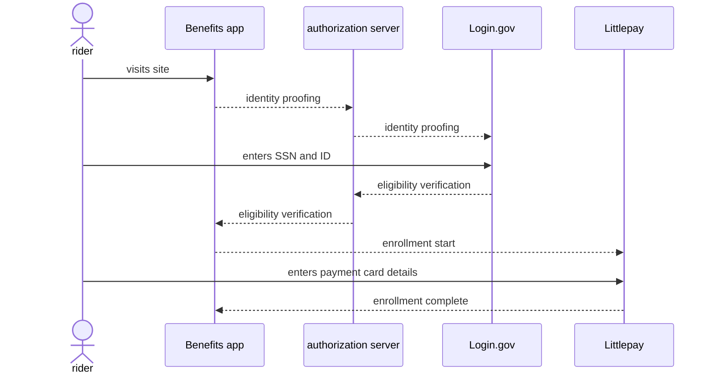

# Home

This website provides technical documentation for the [`benefits`][benefits-repo] application from the
[California Integrated Travel Project (Cal-ITP)][calitp].

Documentation for the `dev` (default) branch is available online at: <https://docs.calitp.org/benefits>.

## Overview

Cal-ITP Benefits is an application that enables automated eligibility verification and enrollment for transit
benefits onto customers' existing contactless bank (credit/debit) cards.

The development of this publicly-accessible client is being managed by Caltrans’ California Integrated Travel Project (Cal-ITP), in partnership with the Department of Motor Vehicles (DMV) and the California Department of Technology (CDT). From the [Cal-ITP site](https://www.calitp.org/):

> Our Cal-ITP Benefits web application streamlines the process for transit riders to instantly qualify for and receive discounts, starting with Monterey-Salinas Transit (MST), which offers a half-price Senior Fare. Now older adults (65+) with a California DMV–issued ID are able to access MST's reduced fares without the hassle of paperwork.
>
> We worked with state partners on this product launch, and next we're working to bring youth, lower-income riders, veterans, people with disabilities, and others the same instant access to free or reduced fares across all California transit providers, without having to prove eligibility to each agency.

The application is accessible to the public at [benefits.calitp.org](https://benefits.calitp.org).

## Technical details

`benefits` is a [Django 3][django] web application. The application talks to one or more [Eligibility Verification APIs](https://docs.calitp.org/eligibility-api/specification) or authentication providers. These APIs and the application are
designed for privacy and security of user information:

- The API communicates with signed and encrypted JSON Web Tokens containing only the most necessary of user data for the purpose of eligibility verification
- The application requires no user accounts and stores no information about the user
- Interaction with the application is anonymous, with only minimal event tracking for usage and problem analysis

Running the application locally is possible with [Docker and Docker Compose][docker]. [Hosting information.][hosting]

The user interface and content is available in both English and Spanish. Additional language support is possible via Django's
[i18n and l10n features][i18n].

The application communicates with external services like [Littlepay][littlepay] via API calls and others like the [authentication server](https://dev.auth.cdt.ca.gov) via redirects, both over the public internet. See [all the system interconnections][interconnections].

## Enrollment process

Success path:

[benefits-repo]: https://github.com/cal-itp/benefits
[calitp]: https://calitp.org
[django]: https://docs.djangoproject.com/en/
[docker]: https://www.docker.com/products/docker-desktop
[interconnections]: deployment/infrastructure/#system-interconnections
[hosting]: deployment/
[littlepay]: https://littlepay.com/
[i18n]: https://docs.djangoproject.com/en/3.2/topics/i18n/
