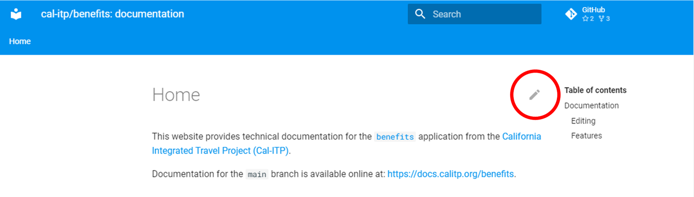

# Home

This website provides technical documentation for the [`benefits`](https://github.com/cal-itp/benefits) application
from the [California Integrated Travel Project (Cal-ITP)](https://www.calitp.org).

Documentation for the `main` branch is available online at: <https://docs.calitp.org/benefits>.

## Building the documentation

This website is built using [`mkdocs`](https://www.mkdocs.org/) from the contents of the `main` branch.

The [`mkdocs.yml`](https://github.com/cal-itp/benefits/blob/dev/mkdocs.yml) file in the repository root configures the build
process, including the available plugins.

### Editing

All content lives under the [`docs/`](../) directory.

To add new sections/articles, create new directories and files under the `docs/` directory, in Markdown format.

The pencil icon is a shortcut to quickly edit the content of the page you are viewing on the website:



*Above: Screenshot showing the edit pencil circled in red*

### Features

- [Material for MkDocs: Reference](https://squidfunk.github.io/mkdocs-material/reference/)

    See `mkdocs.yml` for enabled plugins/features

- [Mermaid](https://mermaid-js.github.io/mermaid/)

    Use code fences with `mermaid` type to render Mermaid diagrams within docs. For example, this markdown:

    ~~~markdown
    ```mermaid
    graph LR
        Start --> Stop
    ```
    ~~~

    Yields this diagram:

    ~~~mermaid
    graph LR
        Start --> Stop
    ~~~
