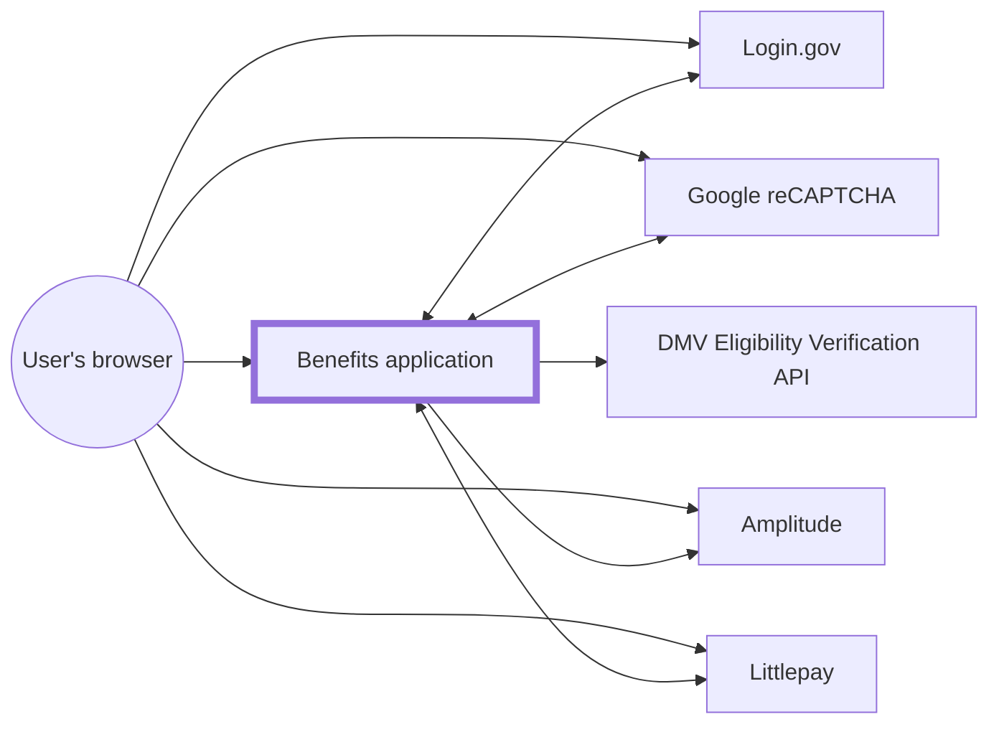
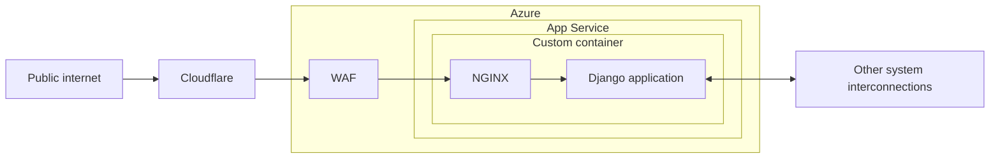

# Azure

[dev-benefits.calitp.org](https://dev-benefits.calitp.org) is currently deployed into a Microsoft Azure account provided by [California Department of Technology (CDT)'s Office of Enterprise Technology (OET)](https://techblog.cdt.ca.gov/2020/06/cdt-taking-the-lead-in-digital-transformation/), a.k.a. the "DevSecOps" team. More specifically, it uses [custom containers](https://docs.microsoft.com/en-us/azure/app-service/configure-custom-container) on [Azure App Service](https://docs.microsoft.com/en-us/azure/app-service/overview).

The infrastructure is configured as code via [Terraform](https://www.terraform.io/), for [various reasons](https://techcommunity.microsoft.com/t5/fasttrack-for-azure/the-benefits-of-infrastructure-as-code/ba-p/2069350). We are adding existing resources to the configuration progressively. In other words, not _all_ our resources in Azure show up under [`terraform/`][terraform-dir], but we are [moving that direction](https://github.com/cal-itp/benefits/issues/618).

## Architecture

### System interconnections



### Benefits application



WAF: [Web Application Firewall](https://azure.microsoft.com/en-us/services/web-application-firewall/)

## Monitoring

We have [ping tests](https://docs.microsoft.com/en-us/azure/azure-monitor/app/monitor-web-app-availability) set up to notify about availability of the dev, test, and prod deployments. Alerts go to [#benefits-notify](https://cal-itp.slack.com/archives/C022HHSEE3F).

## Making changes

1. Get access to the Azure account through the DevSecOps team.
1. Install dependencies:
    - [Azure CLI](https://docs.microsoft.com/en-us/cli/azure/install-azure-cli)
    - [Terraform](https://www.terraform.io/downloads)
1. [Authenticate using the Azure CLI](https://registry.terraform.io/providers/hashicorp/azurerm/latest/docs/guides/azure_cli), specifying the `CDT/ODI Production` Subscription.
1. Outside the [dev container](../../getting-started/), navigate to the [`terraform/`][terraform-dir] directory.
1. [Initialize Terraform.](https://www.terraform.io/cli/commands/init)

    ```sh
    terraform init
    ```

1. Make changes to Terraform files.
1. [Plan](https://www.terraform.io/cli/commands/plan)/[apply](https://www.terraform.io/cli/commands/apply) the changes, as necessary.

    ```sh
    terraform apply
    ```

1. [Submit the changes via pull request.](../development/commits-branches-merging/) Be sure to specify whether they've been applied, i.e. whether they're live or not.

[terraform-dir]: https://github.com/cal-itp/benefits/tree/dev/terraform
