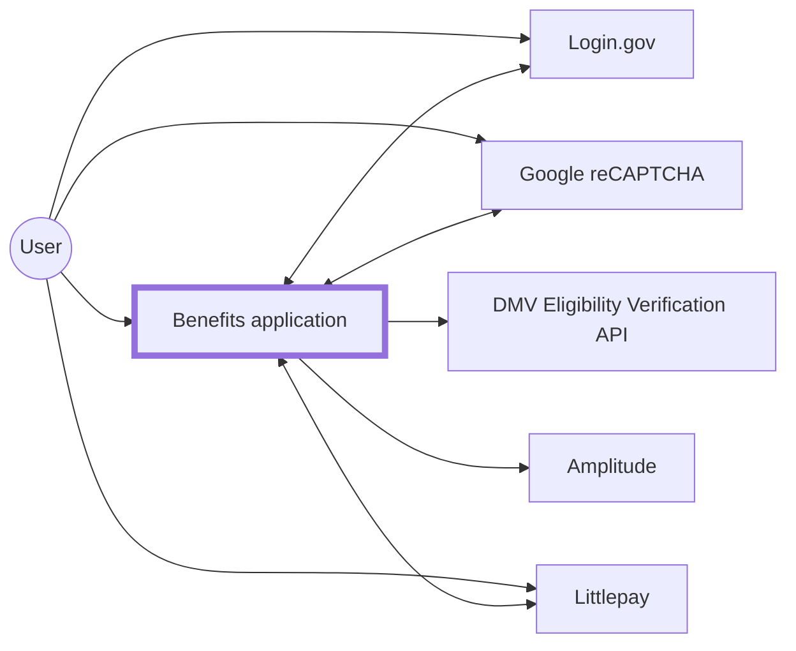
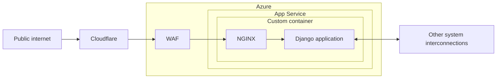

# Azure

[dev-benefits.calitp.org](https://dev-benefits.calitp.org) is currently deployed into a Microsoft Azure account provided by [California Department of Technology (CDT)'s Office of Enterprise Technology (OET)](https://techblog.cdt.ca.gov/2020/06/cdt-taking-the-lead-in-digital-transformation/), a.k.a. the "DevSecOps" team. More specifically, it uses [custom containers](https://docs.microsoft.com/en-us/azure/app-service/configure-custom-container) on [Azure App Service](https://docs.microsoft.com/en-us/azure/app-service/overview).

## Architecture

### System interconnections

### Benefits application

WAF: [Web Application Firewall](https://azure.microsoft.com/en-us/services/web-application-firewall/)
