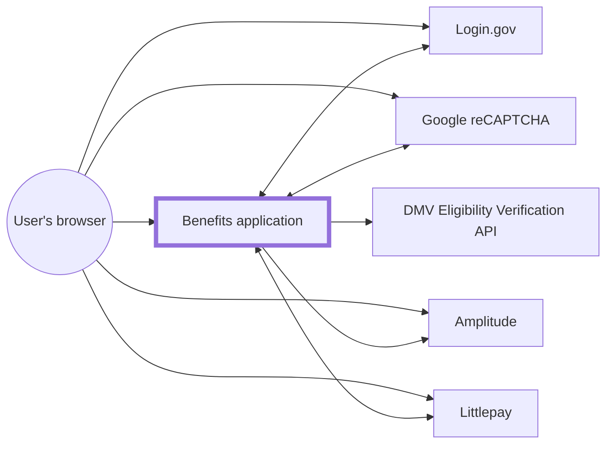
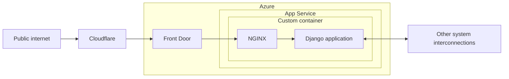

# Infrastructure

The infrastructure is configured as code via [Terraform](https://www.terraform.io/), for [various reasons](https://techcommunity.microsoft.com/t5/fasttrack-for-azure/the-benefits-of-infrastructure-as-code/ba-p/2069350). There are two subscriptions, with a single [resource group](https://docs.microsoft.com/en-us/azure/azure-resource-manager/management/manage-resource-groups-portal) under each:

- `CDT/ODI Development` - Meant for experimentation with short-lived resources
- `CDT/ODI Production` - All resources in here should be reflected in Terraform in this repository. The exception is secrets, such as values under [Key Vault](https://azure.microsoft.com/en-us/services/key-vault/) and [App Service application settings](https://docs.microsoft.com/en-us/azure/app-service/configure-common#configure-app-settings).

For browsing the [Azure portal](https://portal.azure.com), [switching your `Default subscription filter`](https://docs.microsoft.com/en-us/azure/azure-portal/set-preferences) to only `CDT/ODI Production` is recommended.

## Architecture

### System interconnections



### Benefits application



[Front Door](https://docs.microsoft.com/en-us/azure/frontdoor/front-door-overview) also includes the [Web Application Firewall (WAF)](https://docs.microsoft.com/en-us/azure/web-application-firewall/afds/afds-overview). Both are managed by the DevSecOps team.

## Monitoring

We have [ping tests](https://docs.microsoft.com/en-us/azure/azure-monitor/app/monitor-web-app-availability) set up to notify about availability of the dev, test, and prod deployments. Alerts go to [#benefits-notify](https://cal-itp.slack.com/archives/C022HHSEE3F).

## Logs

We send application logs to [Azure Monitor Logs](https://docs.microsoft.com/en-us/azure/azure-monitor/logs/data-platform-logs). To find them:

1. [Open Application Insights.](https://portal.azure.com/#view/HubsExtension/BrowseResource/resourceType/microsoft.insights%2Fcomponents)
1. Click the resource corresponding to the environment.
1. In the navigation, under `Monitoring`, click `Logs`.
1. In the Query Editor, type `requests` or `traces`, and click `Run`.
    - [What each means](https://docs.microsoft.com/en-us/azure/azure-monitor/app/opencensus-python#telemetry-type-mappings)

You should see recent log output. Note [there is some latency](https://docs.microsoft.com/en-us/azure/azure-monitor/logs/data-ingestion-time).

## Making changes

1. Get access to the Azure account through the DevSecOps team.
1. Install dependencies:
   - [Azure CLI](https://docs.microsoft.com/en-us/cli/azure/install-azure-cli)
   - [Terraform](https://www.terraform.io/downloads)
1. [Authenticate using the Azure CLI](https://registry.terraform.io/providers/hashicorp/azurerm/latest/docs/guides/azure_cli), specifying the `CDT/ODI Production` Subscription.
1. Outside the [dev container](../../getting-started/), navigate to the [`terraform/`][terraform-dir] directory.
1. [Initialize Terraform.](https://www.terraform.io/cli/commands/init)

   ```sh
   terraform init
   ```

1. Make changes to Terraform files.
1. [Plan](https://www.terraform.io/cli/commands/plan)/[apply](https://www.terraform.io/cli/commands/apply) the changes, as necessary.

   ```sh
   terraform apply
   ```

1. [Submit the changes via pull request.](../development/commits-branches-merging/) Be sure to specify whether they've been applied, i.e. whether they're live or not.

For Azure resources, you need to [ignore changes](https://www.terraform.io/language/meta-arguments/lifecycle#ignore_changes) to tags, since they are [automatically created by Azure Policy](https://docs.microsoft.com/en-us/azure/azure-resource-manager/management/tag-policies).

```hcl
lifecycle {
  ignore_changes = [tags]
}
```

[terraform-dir]: https://github.com/cal-itp/benefits/tree/dev/terraform
