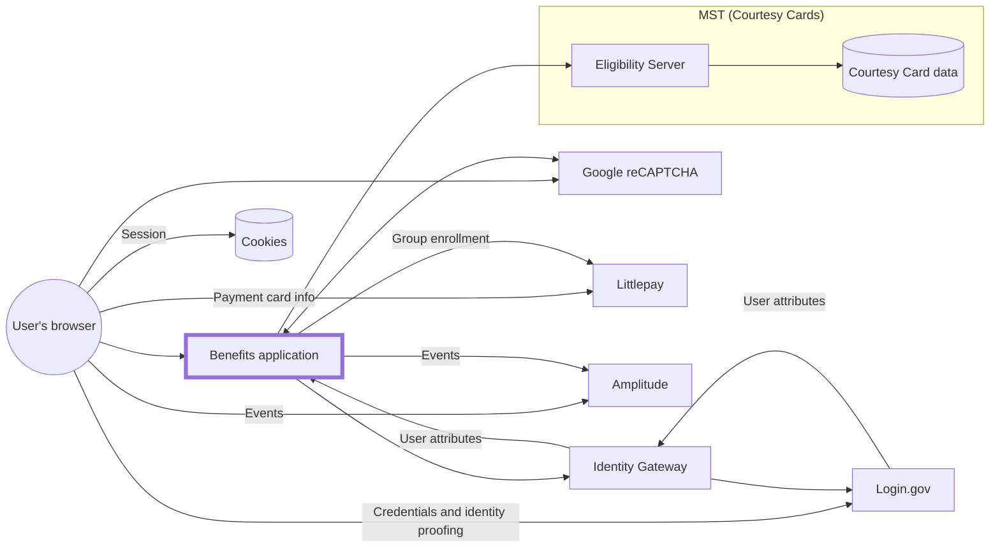
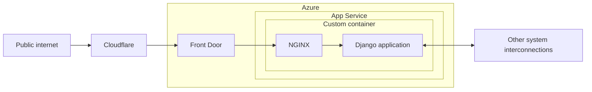

# Infrastructure

The infrastructure is configured as code via [Terraform](https://www.terraform.io/), for [various reasons](https://techcommunity.microsoft.com/t5/fasttrack-for-azure/the-benefits-of-infrastructure-as-code/ba-p/2069350).

## Architecture

### System interconnections



### Benefits application



[Front Door](https://docs.microsoft.com/en-us/azure/frontdoor/front-door-overview) also includes the [Web Application Firewall (WAF)](https://docs.microsoft.com/en-us/azure/web-application-firewall/afds/afds-overview) and handles TLS termination. Front Door is managed by the DevSecOps team.

## Ownership

The following things in Azure are managed by the California Department of Technology (CDT)'s DevSecOps (OET) team:

- Subcriptions
- [Resource Groups](https://learn.microsoft.com/en-us/azure/azure-resource-manager/management/manage-resource-groups-portal)
- Networking
- Front Door
  - Web Application Firewall (WAF)
  - Distributed denial-of-service (DDoS) protection
- IAM
- Service connections

## Environments

Within the `CDT Digital CA` directory ([how to switch](https://learn.microsoft.com/en-us/azure/devtest/offer/how-to-change-directory-tenants-visual-studio-azure)), there are two [Subscriptions](https://learn.microsoft.com/en-us/microsoft-365/enterprise/subscriptions-licenses-accounts-and-tenants-for-microsoft-cloud-offerings?view=o365-worldwide#subscriptions), with Resource Groups under each. Each environment corresponds to a single Resource Group, [Terraform Workspace](https://developer.hashicorp.com/terraform/language/state/workspaces), and branch.

| Environment | Subscription          | Resource Group                | Workspace | Branch |
| ----------- | --------------------- | ----------------------------- | --------- | ------ |
| Dev         | `CDT/ODI Development` | `RG-CDT-PUB-VIP-CALITP-D-001` | `dev`     | `dev`  |
| Test        | `CDT/ODI Development` | `RG-CDT-PUB-VIP-CALITP-T-001` | `test`    | `test` |
| Prod        | `CDT/ODI Production`  | `RG-CDT-PUB-VIP-CALITP-P-001` | `default` | `prod` |

All resources in these Resource Groups should be reflected in Terraform in this repository. The exceptions are:

- Secrets, such as values under [Key Vault](https://azure.microsoft.com/en-us/services/key-vault/). [`prevent_destroy`](https://developer.hashicorp.com/terraform/tutorials/state/resource-lifecycle#prevent-resource-deletion) is used on these Resources.
- [Things managed by DevSecOps](#ownership)

You'll see these referenced in Terraform as [data sources](https://developer.hashicorp.com/terraform/language/data-sources).

For browsing the [Azure portal](https://portal.azure.com), you can [switch your `Default subscription filter`](https://docs.microsoft.com/en-us/azure/azure-portal/set-preferences).

## Making changes

[](https://calenterprise.visualstudio.com/CDT.OET.CAL-ITP/_build/latest?definitionId=828&branchName=dev)

Terraform is [`plan`](https://www.terraform.io/cli/commands/plan)'d when code is pushed to any branch on GitHub, then [`apply`](https://www.terraform.io/cli/commands/apply)'d when merged to `dev`. While other automation for this project is done through GitHub Actions, we use an Azure Pipeline (above) for a couple of reasons:

- Easier authentication with the Azure API using a service connnection
- Log output is hidden, avoiding accidentally leaking secrets

### Local development

1. Get access to the Azure account through the DevSecOps team.
1. Install dependencies:

   - [Azure CLI](https://docs.microsoft.com/en-us/cli/azure/install-azure-cli)
   - [Terraform](https://www.terraform.io/downloads) - see exact version in [`deploy.yml`](https://github.com/cal-itp/benefits/blob/dev/terraform/pipeline/deploy.yml)

1. [Authenticate using the Azure CLI](https://registry.terraform.io/providers/hashicorp/azurerm/latest/docs/guides/azure_cli).

   ```sh
   az login
   ```

1. Outside the [dev container](../../getting-started/), navigate to the [`terraform/`](https://github.com/cal-itp/benefits/tree/dev/terraform) directory.
1. [Initialize Terraform.](https://www.terraform.io/cli/commands/init) You can also use this script later to switch between [environments](#environments).

   ```sh
   ./init.sh <env>
   ```

1. Make changes to Terraform files.
1. Preview the changes, as necessary.

   ```sh
   terraform plan
   ```

1. [Submit the changes via pull request.](../development/commits-branches-merging/)

For Azure resources, you need to [ignore changes](https://www.terraform.io/language/meta-arguments/lifecycle#ignore_changes) to tags, since they are [automatically created by Azure Policy](https://docs.microsoft.com/en-us/azure/azure-resource-manager/management/tag-policies).

```hcl
lifecycle {
  ignore_changes = [tags]
}
```

### Naming conventions

The DevSecOps team sets the following naming convention for Resources:

```
<<Resource Type>>-<<Department>>-<<Public/Private>>-<<Project Category>>-<<Project Name>>-<<Region>><<OS Type>>-<<Environment>>-<<Sequence Number>>
```

#### Sample Names

- `RG-CDT-PUB-VIP-BNSCN-E-D-001`
- `ASP-CDT-PUB-VIP-BNSCN-EL-P-001`
- `AS-CDT-PUB-VIP-BNSCN-EL-D-001`

#### Resource Types

Use the following shorthand for conveying the Resource Type as part of the Resource Name:

| Resource         | Convention |
| ---------------- | ---------- |
| App Service      | `AS`       |
| App Service Plan | `ASP`      |
| Virtual Network  | `VNET`     |
| Resource Group   | `RG`       |
| Virtual Machine  | `VM`       |
| Database         | `DB`       |
| Subnet           | `SNET`     |
| Front Door       | `FD`       |

## Azure environment setup

The following steps are required to set up the environment, with linked issues to automate them:

- `terraform apply`
- Set up Slack notifications by [creating a Slack email](https://slack.com/help/articles/206819278-Send-emails-to-Slack) for the [#benefits-notify](https://cal-itp.slack.com/archives/C022HHSEE3F) channel, then [setting it as a Secret in the Key Vault](https://learn.microsoft.com/en-us/azure/key-vault/secrets/quick-create-portal#add-a-secret-to-key-vault) named `slack-benefits-notify-email`
- Set required [App Service configuration](../configuration/environment-variables.md) and [configuration](../configuration/data.md) by setting values in Key Vault (the mapping is defined in [app_service.tf](https://github.com/cal-itp/benefits/blob/dev/terraform/app_service.tf))
- [Set up webhook from GitHub](https://github.com/cal-itp/benefits/settings/hooks) to [App Service Deployment Center](https://learn.microsoft.com/en-us/azure/app-service/deploy-ci-cd-custom-container?tabs=acr&pivots=container-linux) for the `Packages` event

This is not a complete step-by-step guide; more a list of things to remember. This may be useful as part of [incident response](https://docs.google.com/document/d/1qtev8qItPiTB4Tp9FQ87XsLtWZ4HlNXqoe9vF2VuGcY/edit#).
