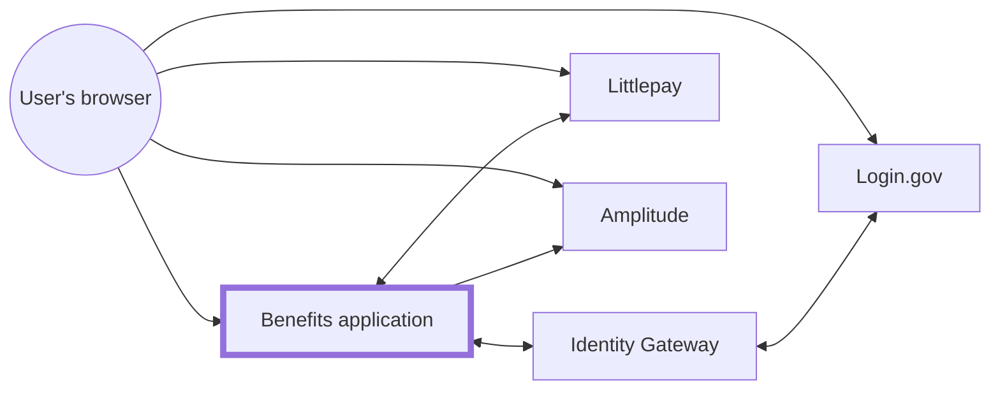
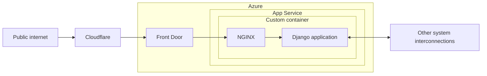

# Infrastructure

The infrastructure is configured as code via [Terraform](https://www.terraform.io/), for [various reasons](https://techcommunity.microsoft.com/t5/fasttrack-for-azure/the-benefits-of-infrastructure-as-code/ba-p/2069350).

## Architecture

### System interconnections



### Benefits application



[Front Door](https://docs.microsoft.com/en-us/azure/frontdoor/front-door-overview) also includes the [Web Application Firewall (WAF)](https://docs.microsoft.com/en-us/azure/web-application-firewall/afds/afds-overview).

## Ownership

The following things in Azure are managed by the California Department of Technology (CDT)'s DevSecOps (OET) team:

- Subcriptions
- [Resource Groups](https://learn.microsoft.com/en-us/azure/azure-resource-manager/management/manage-resource-groups-portal)
- Networking
- Front Door
- IAM
- Service connections

## Environments

| Environment | Subscription          | Resource Group                | Workspace | Branch |
| ----------- | --------------------- | ----------------------------- | --------- | ------ |
| Dev         | `CDT/ODI Development` | `RG-CDT-PUB-VIP-CALITP-D-001` | `dev`     | `dev`  |
| Test        | `CDT/ODI Development` | `RG-CDT-PUB-VIP-CALITP-T-001` | `test`    | `test` |
| Prod        | `CDT/ODI Production`  | `RG-CDT-PUB-VIP-CALITP-P-001` | `default` | `prod` |

All resources in these Resource Groups should be reflected in Terraform in this repository. The exceptions are:

- Secrets, such as values under [Key Vault](https://azure.microsoft.com/en-us/services/key-vault/) and [App Service application settings](https://docs.microsoft.com/en-us/azure/app-service/configure-common#configure-app-settings). [`prevent_destroy`](https://developer.hashicorp.com/terraform/tutorials/state/resource-lifecycle#prevent-resource-deletion) is used on these Resources.
- [Things managed by DevSecOps](#ownership)

For browsing the [Azure portal](https://portal.azure.com), you can [switch your `Default subscription filter`](https://docs.microsoft.com/en-us/azure/azure-portal/set-preferences).

## Monitoring

We have [ping tests](https://docs.microsoft.com/en-us/azure/azure-monitor/app/monitor-web-app-availability) set up to notify about availability of each environment. Alerts go to [#benefits-notify](https://cal-itp.slack.com/archives/C022HHSEE3F).

## Logs

Logs can be found a couple of places:

### Azure App Service Logs

[Open the `Logs` for the environment you are interested in.](https://docs.google.com/document/d/11EPDIROBvg7cRtU2V42c6VBxcW_o8HhcyORALNtL_XY/edit#heading=h.6pxjhslhxwvj) The following tables are likely of interest:

- `AppServiceConsoleLogs`: `stdout` and `stderr` coming from the container
- `AppServiceHTTPLogs`: requests coming through App Service
- `AppServicePlatformLogs`: deployment information

For some pre-defined queries, click `Queries`, then `Group by: Query type`, and look under `Query pack queries`.

### [Azure Monitor Logs](https://docs.microsoft.com/en-us/azure/azure-monitor/logs/data-platform-logs)

[Open the `Logs` for the environment you are interested in.](https://docs.google.com/document/d/11EPDIROBvg7cRtU2V42c6VBxcW_o8HhcyORALNtL_XY/edit#heading=h.n0oq4r1jo7zs)

The following [tables](https://docs.microsoft.com/en-us/azure/azure-monitor/app/opencensus-python#telemetry-type-mappings) are likely of interest:

- `requests`
- `traces`

In the latter two, you should see recent log output. Note [there is some latency](https://docs.microsoft.com/en-us/azure/azure-monitor/logs/data-ingestion-time).

See [`Failures`](https://docs.microsoft.com/en-us/azure/azure-monitor/app/asp-net-exceptions#diagnose-failures-using-the-azure-portal) in the sidebar (or `exceptions` under `Logs`) for application errors/exceptions.

### Live tail

After [setting up the Azure CLI](#making-changes), you can use the following command to [stream live logs](https://docs.microsoft.com/en-us/azure/app-service/troubleshoot-diagnostic-logs#in-local-terminal):

```sh
az webapp log tail --resource-group RG-CDT-PUB-VIP-CALITP-P-001 --name AS-CDT-PUB-VIP-CALITP-P-001 2>&1 | grep -v /healthcheck
```

### SCM

https://as-cdt-pub-vip-calitp-p-001-dev.scm.azurewebsites.net/api/logs/docker

## Making changes

[](https://calenterprise.visualstudio.com/CDT.OET.CAL-ITP/_build/latest?definitionId=828&branchName=dev)

Terraform is [`plan`](https://www.terraform.io/cli/commands/plan)'d when code is pushed to any branch on GitHub, then [`apply`](https://www.terraform.io/cli/commands/apply)'d when merged to `dev`. While other automation for this project is done through GitHub Actions, we use an Azure Pipeline (above) for a couple of reasons:

- Easier authentication with the Azure API using a service connnection
- Log output is hidden, avoiding accidentally leaking secrets

### Local development

1. Get access to the Azure account through the DevSecOps team.
1. Install dependencies:

   - [Azure CLI](https://docs.microsoft.com/en-us/cli/azure/install-azure-cli)
   - [Terraform](https://www.terraform.io/downloads) - see exact version in [`azure-pipelines.yml`](https://github.com/cal-itp/benefits/blob/dev/terraform/azure-pipelines.yml)

1. [Authenticate using the Azure CLI](https://registry.terraform.io/providers/hashicorp/azurerm/latest/docs/guides/azure_cli), specifying the `CDT/ODI Development` Subscription.

   ```sh
   az login

   az account set --subscription="CDT/ODI Development"
   ```

1. Outside the [dev container](../../getting-started/), navigate to the [`terraform/`](https://github.com/cal-itp/benefits/tree/dev/terraform) directory.
1. [Initialize Terraform.](https://www.terraform.io/cli/commands/init) [The Backend Subscription](https://developer.hashicorp.com/terraform/language/settings/backends/azurerm#subscription_id) needs to be specified so that you can work across Subscriptions.

   ```sh
   PROD_ID=$(az account list --query "[?name == 'CDT/ODI Production'] | [0].id" --output tsv)
   terraform init -backend-config="subscription_id=$PROD_ID"
   ```

1. Make changes to Terraform files.
1. Preview the changes, as necessary.

   ```sh
   terraform plan
   ```

1. [Submit the changes via pull request.](../development/commits-branches-merging/)

For Azure resources, you need to [ignore changes](https://www.terraform.io/language/meta-arguments/lifecycle#ignore_changes) to tags, since they are [automatically created by Azure Policy](https://docs.microsoft.com/en-us/azure/azure-resource-manager/management/tag-policies).

```hcl
lifecycle {
  ignore_changes = [tags]
}
```

## Azure environment setup

The following steps are required to set up the environment, with linked issues to automate them:

- `terraform apply`
- Set required [App Service configuration](../configuration/environment-variables.md)
- Bind the certificate - [#704](https://github.com/cal-itp/benefits/issues/704)

This is not a complete step-by-step guide; more a list of things to remember. This may be useful as part of incident response.
