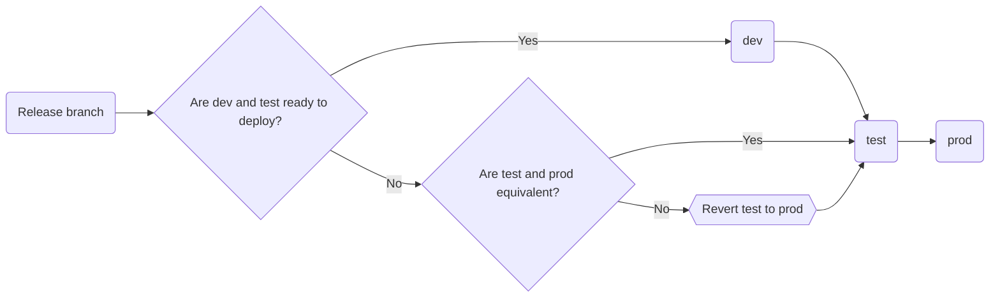

# Making a release

This list outlines the manual steps needed to make a new release of the
`benefits` app.

A release is made by merging changes into the `prod` branch, which kicks off a
deployment to the production environment. More details on the deployment steps
can be found under [Workflows](./workflows.md).

The list of releases can be found on the [repository Releases page](https://github.com/cal-itp/benefits/tags)
on GitHub.

## 0. Decide on the new version number

A new release implies a new version.

`benefits` uses the [CalVer](https://calver.org/) versioning scheme, where
version numbers look like: `YYYY.0M.R`

- `YYYY` is the 4-digit year of the release; e.g. `2021`, `2022`
- `0M` is the 2-digit, 0-padded month of the release; e.g. `02` is February, `12`
  is December.
- `R` is the 1-based release counter for the given year and month;
  e.g. `1` for the first release of the month, `2` for the second, and so on.

## 1. Prepare release in a branch

Typically changes for a release will move from `dev`, to `test`, to `prod`. This
assumes `dev` is in a state that it can be deployed without disruption.

If `dev` or `test` contain in-progress work that is not ready for production,
and a hotfix is needed in production, a separate process to test the changes
before deploying to `prod` must be undertaken.

The following diagram shows how a release should propogate to `prod` under
different circumstances:



By convention the release branch is called `release/YYYY.0M.R` using the
upcoming version number.

## 2. Bump the application version number

The app code maintains a version number in
[`benefits/__init__.py`](https://github.com/cal-itp/benefits/blob/dev/benefits/__init__.py),
used by the instrumentation and logging systems.

This version number must be updated to match the new version in the same format:
`YYYY.0M.R`

## 3. Open a PR

Initially from the release branch to the target environment branch, following
the merge sequence in the diagram above.

## 4. Merge the PR

After checks pass and review approval is given, merge the PR to kick off the
deployment.

Repeat steps 3 and 4 for each deployment environment target, again following the
merge sequence in the diagram above.

## 5. Tag the release

Once the deploy has completed to `prod`, the version can be tagged and pushed to
GitHub.

From a local terminal:

```bash
git fetch

git checkout prod

git reset --hard origin/prod

git tag YYYY.0M.R

git push --tags
```

## 6. [Generate release notes](https://docs.github.com/en/repositories/releasing-projects-on-github/automatically-generated-release-notes)

Also add a written description, and include screenshots/animations of new/updated pages/workflows.
