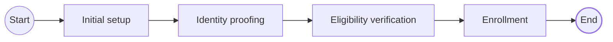
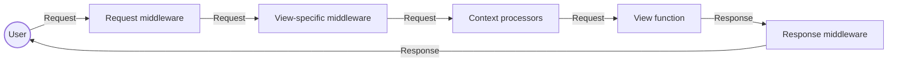
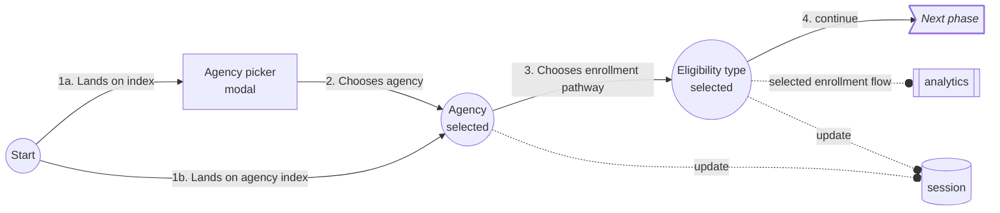
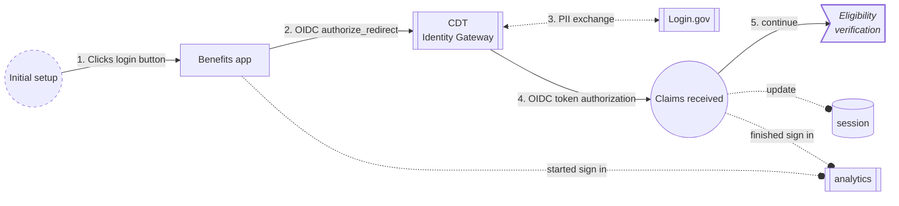
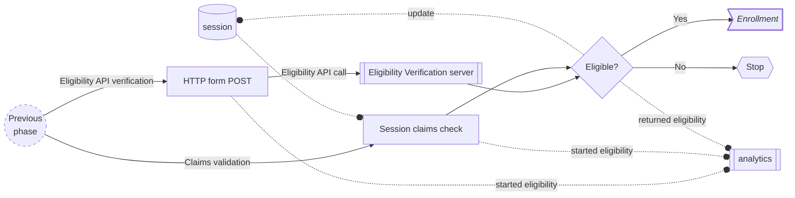
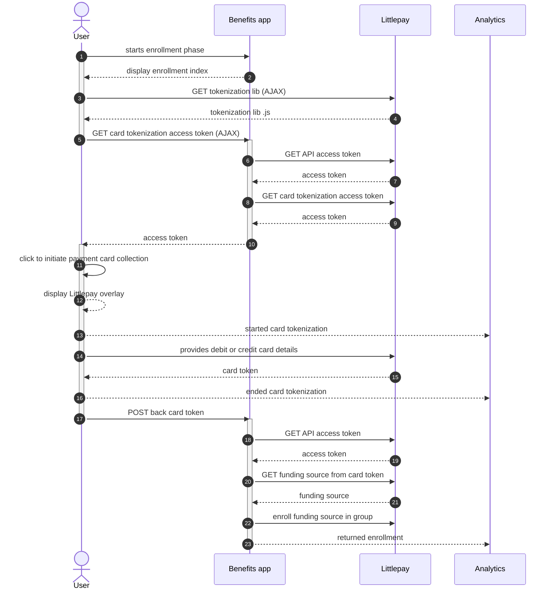

# Application logic

!!! info "See also"

    More specific user flow diagrams: [Enrollment pathways](../enrollment-pathways/README.md)

This page describes how Cal-ITP Benefits defines user flows through the following high-level _phases_:

1. [Initial setup](#initial-setup)
1. [Identity proofing](#identity-proofing)
1. [Eligibility verification](#eligibility-verification)
1. [Enrollment](#enrollment)

The structure of the source code in [`benefits/`](https://github.com/cal-itp/benefits/tree/main/benefits)
generally follows from these phases:

- [`benefits/core/`](https://github.com/cal-itp/benefits/tree/main/benefits/core) implements shared logic and models, and
  defines the user's entrypoint into the app
- [`benefits/oauth/`](https://github.com/cal-itp/benefits/tree/main/benefits/oauth) implements identity proofing
- [`benefits/eligibility/`](https://github.com/cal-itp/benefits/tree/main/benefits/eligibility) implements eligibility
  verification
- [`benefits/enrollment/`](https://github.com/cal-itp/benefits/tree/main/benefits/enrollment) implements enrollment

Each of these directories contains a standalone Django app registered in the [settings](../configuration/README.md#django-settings).

All of the common logic and [database models and migrations](./models-migrations.md) are defined in `benefits.core`, and this
app is imported by the other apps.

## Django request pipeline

Each request to the Benefits app is ultimately a [Django request](https://docs.djangoproject.com/en/5.0/ref/request-response/)
and goes through the [Django HTTP request pipeline](https://docs.djangoproject.com/en/5.0/topics/http/).

Benefits uses middleware to pre- and post-process requests for (view) access control, session configuration, and analytics.
Benefits also uses context processors to enrich the Django template context with data needed for rendering on the front-end.

!!! example "Key supporting files"

    [`benefits/core/context_processors.py`][core-context-processors]

    [`benefits/core/middleware.py`][core-middleware]

In general, the flow of a Django request looks like:

## Initial setup

In this phase, the user makes the initial selections that will configure the rest of their journey.

!!! example "Entrypoint"

    [`benefits/core/views.py`][core-views]

!!! example "Key supporting files"

    [`benefits/core/models.py`][core-models]

    [`benefits/core/session.py`][core-session]

Depending upon the choice of enrollment pathway, the _Next phase_ above may be:

- [Identity proofing](#identity-proofing), for all flows that require user PII (such as for verifying age).
- [Eligibility verification](#eligibility-verification), for Agency card flows that require a physical card from the transit
  agency.

## Identity proofing

In this phase, Cal-ITP Benefits takes the user through an [OpenID Connect (OIDC)](https://openid.net/developers/how-connect-works/)
flow as a Client (the Relying Party or RP) of the CDT Identity Gateway (the Identity Provider or IDP), via Login.gov.

The CDT Identity Gateway transforms PII from Login.gov into anonymized boolean claims that are later used in
[eligibility verification](#eligibility-verification).

!!! example "Entrypoint"

    [`benefits/oauth/views.py`][oauth-views]

!!! example "Key supporting files"

    [`benefits/oauth/client.py`][oauth-client]

    [`benefits/oauth/redirects.py`][oauth-redirects]

## Eligibility verification

In this phase, Cal-ITP Benefits verifies the user's claims using one of two methods:

- Claims validation, using claims previously stored in the user's session during [Identity proofing](#identity-proofing)
- Eligibility API verification, using non-PII claims provided by the user in an HTML form submission

!!! example "Entrypoint"

    [`benefits/eligibility/views.py`][eligibility-views]

!!! example "Key supporting files"

    [`benefits/eligibility/verify.py`][eligibility-verify]

## Enrollment

In this final phase, the user registers their contactless payment card with a concession group configured within the
transit processor (Littlepay).

**_Cal-ITP Benefits never processes, transmits, nor stores the user's payment card details._**

!!! example "Entrypoint"

    [`benefits/enrollment/views.py`][enrollment-views]

!!! example "Supporting packages"

    [`cal-itp/littlepay`][littlepay]

[core-context-processors]: https://github.com/cal-itp/benefits/blob/main/benefits/core/context_processors.py
[core-middleware]: https://github.com/cal-itp/benefits/blob/main/benefits/core/middleware.py
[core-models]: https://github.com/cal-itp/benefits/blob/main/benefits/core/models.py
[core-session]: https://github.com/cal-itp/benefits/blob/main/benefits/core/session.py
[core-views]: https://github.com/cal-itp/benefits/blob/main/benefits/core/views.py
[eligibility-verify]: https://github.com/cal-itp/benefits/blob/main/benefits/eligibility/verify.py
[eligibility-views]: https://github.com/cal-itp/benefits/blob/main/benefits/eligibility/views.py
[enrollment-views]: https://github.com/cal-itp/benefits/blob/main/benefits/enrollment/views.py
[littlepay]: https://github.com/cal-itp/littlepay
[oauth-client]: https://github.com/cal-itp/benefits/blob/main/benefits/oauth/client.py
[oauth-redirects]: https://github.com/cal-itp/benefits/blob/main/benefits/oauth/redirects.py
[oauth-views]: https://github.com/cal-itp/benefits/blob/main/benefits/oauth/views.py
