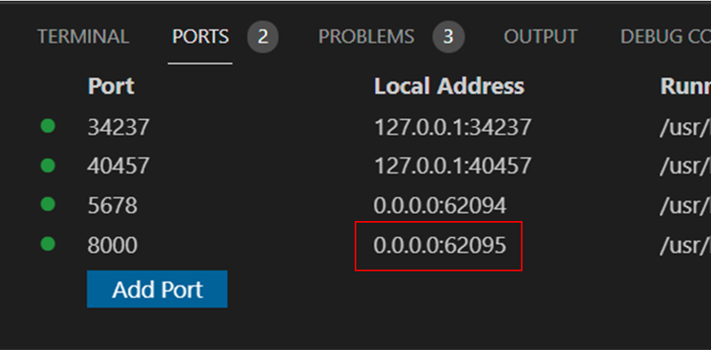

# Docker dynamic ports

Docker dynamically assigns host machine ports that map into container application ports.

## Inside the Devcontainer

!!! info

    The Devcontainer can bind to a single container's port(s) and present those to your localhost machine via VS Code.
    Other services started along with the Devcontainer are not visible in VS Code. See
    [Outside the Devconatiner](#outside-the-devcontainer) for how to find information on those.

Once started with <kbd>F5</kbd>, the `benefits` Django application runs on port `8000` inside the Devcontainer. To find the localhost
address, look on the **PORTS** tab in VS Code's _Terminal_ window. The `Local Address` corresponding to the record where
`8000` is in the `Port` column is where the site is accessible on your host machine.

Replace `0.0.0.0` with `localhost` and use the same port number shown in the `Local Address` column. This is highlighted by the
red box in the image below:



## Outside the Devcontainer

When running a `docker compose ...` command, or in other scenarios outside of the Devcontainer, there are multiple ways to find
the `http://localhost` port corresponding to the service in question.

### Docker Desktop

The Docker Desktop application shows information about running containers and services/groups, including information about
bound ports. In most cases, the application provides a button to launch a container/service directly in your browser when a
port binding is available.

In the **Containers / Apps** tab, expand the service group if needed to find the container in question, where you should see
labels indicating the container is `RUNNING` and bound to `PORT: XYZ`.

Hover over the container in question, and click the **Open in Browser** button to launch the app in your web browser.


### Docker CLI commands

Using the `docker` command line interface, you can find the bound port(s) of running containers.

```bash
docker ps -f name=<service>
```

e.g. for the `docs` service:

```bash
docker ps -f name=docs
```

This prints output like the following:

```console
CONTAINER ID   IMAGE                 COMMAND                  CREATED         STATUS         PORTS                     NAMES
0d5b2e1fb910   benefits_client:dev   "mkdocs serve --dev-…"   2 minutes ago   Up 2 minutes   0.0.0.0:62093->8000/tcp   benefits_docs_1
```

Looking at the `PORTS` column:

```console
PORTS
0.0.0.0:62093->8000/tcp
```

We can see that locally, port `62093` is bound to the container port `8000`.

In this case, entering `http://localhost:62093` in the web browser navigates to the `docs` site homepage.
