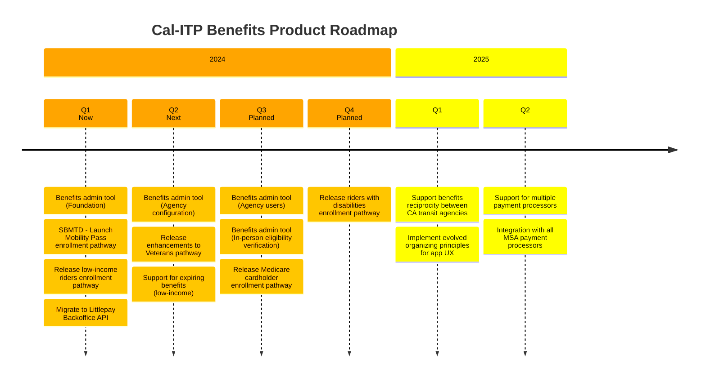

# Enrollment pathways

This section describes in more detail some of the different enrollment pathways with current or planned support in the Benefits application.

## Current work

We do sprint planning and track day-to-day work on our [Project Board][board].

See our [Milestones][milestones] for current work tracked against specific features and different enrollment pathways.

## Product roadmap

See our Product Roadmap for more information on planned feature development and prioritization.

[board]: https://github.com/orgs/cal-itp/projects/8/views/1
[milestones]: https://github.com/cal-itp/benefits/milestones
[roadmap]: https://docs.google.com/document/d/1IFoa8Ye0IXwGXXwxFjMrm1s3617Dbv6l-E-aCB0kgnA/edit#
