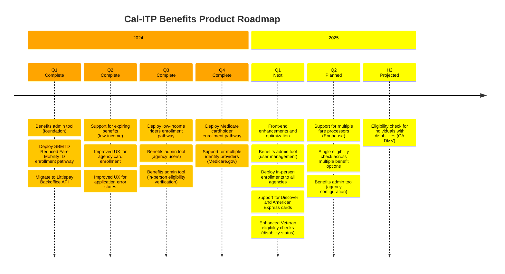

# Enrollment pathways

This section describes in more detail some of the different enrollment pathways with current or planned support in the Benefits application.

## Current work

We do sprint planning and track day-to-day work on our [Project Board][board].

See our [Milestones][milestones] for current work tracked against specific features and different enrollment pathways.

## Product roadmap

Our product roadmap captures what we're currently building, what we've built, and what we plan to build in the future. We update it at the end of each quarter or when priorities change.

[board]: https://github.com/orgs/cal-itp/projects/8/views/1
[milestones]: https://github.com/cal-itp/benefits/milestones
