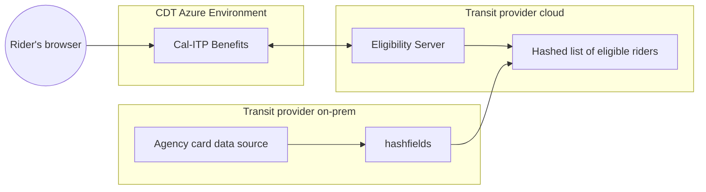
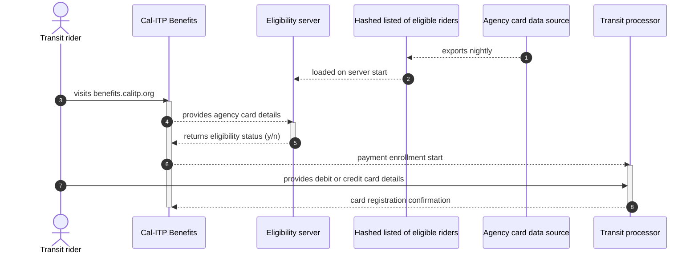

# Agency cards

An _agency card_ is a generic term for the proprietary physical card tranist providers issue to eligible riders to show they participate in the provider's reduced fare program. The [Courtesy Card program](https://mst.org/riders-guide/how-to-ride/courtesy-card/) at Monterey-Salinas Transit (MST) is a good example. Agency card programs pre-date the option of fare collection using contactless payments. Tranist providers oftern require riders to show the card to bus operators when boarding to proove their eligibility for reduced fares.

During the pilot phase of Cal-ITP Benefits, we offered the agency card enrollment option to transit providers that were early adopters of contactless payments and wanted to use Cal-ITP Benefits as a way to enroll riders in discount groups the application didn't yet support, such as Medicare cardholders and people with disabilities. As the range of enrollment options in the app expands to cover previously unsupported discount groups, the agency card enrollment option becomes less necessary. We plan to deprecate the agency card enrollment option when the application offers enrollent pathways for all required groups.

The agency card enrollment option differs from other options in the application because of the way the app verifies a rider's eligibility for transit benefits. When a rider chooses the agency card enrollment pathway, the application uses the [Eligibility API call](https://docs.calitp.org/eligibility-api/specification/). This API call queries data stored offline on the agency side to confirm the rider is active in the program. For all other enrollment options, the Cal-ITP Benefits app confirms rider eligibility by querying external data sources via to the CDT Identity Gateway. See the [older adult enrollment pathway](https://docs.calitp.org/benefits/enrollment-pathways/older-adults/) as one example.

## Demonstration

This video shows the rider experience enrolling for transit benefits using the agency card enrollment pathway.

<iframe width="560" height="315" src="https://www.youtube-nocookie.com/embed/_iOb19cLg30?si=G-4-CiNd88_vp0dj&amp;controls=0" title="YouTube video player" frameborder="0" allow="accelerometer; autoplay; clipboard-write; encrypted-media; gyroscope; picture-in-picture; web-share" allowfullscreen></iframe>

## Architecture

To support an agency card deployment in Cal-ITP Benefits, the transit provider produces a list of eligible riders in CSV format. That file is loaded into an instance of the [Eligibility Server](https://docs.calitp.org/eligibility-server/) running in the transit provider's cloud.

Cal-ITP uses the [`hashfields` tool](https://docs.calitp.org/hashfields) to mask user data before it leaves the transit provider's on-premise systems to protect rider personal information.

### System architecture

Notes:

- [Eligibility Server source code](https://github.com/cal-itp/eligibility-server)
- [hashfields source code](https://github.com/cal-itp/hashfields)
- [More details about the Benefits architecture](../../deployment/infrastructure/#architecture)
- At MST, the `Data Source` is Velocity, the product MST uses to manage and print Courtesy Cards.

## Process

