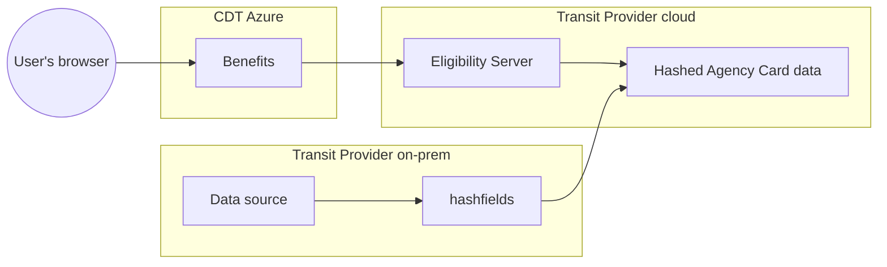
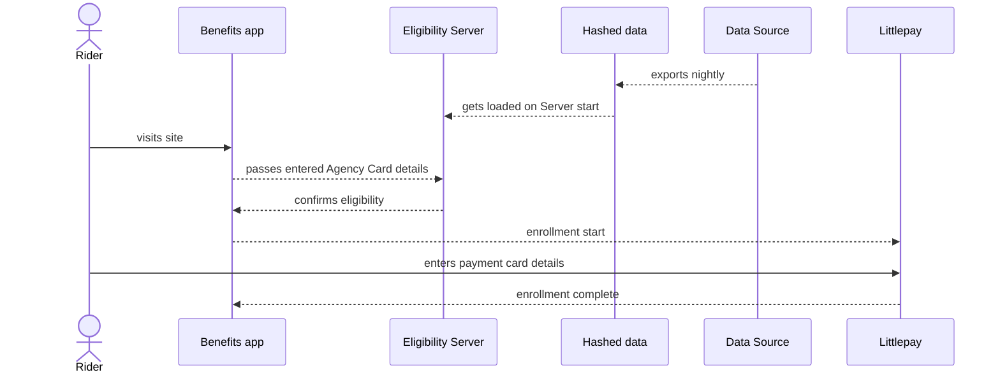

# Agency Cards

_Agency Cards_ is a generic term for reduced fare programs offered by Transit Providers, such as the
[Courtesy Card program from Monterey-Salinas Transit (MST)](https://mst.org/riders-guide/how-to-ride/courtesy-card/).

Agency cards are different from our other use cases in that eligibility verification happens on the agency side (offline) rather
than through the Benefits app, and the Benefits app then checks for a valid Agency Card via an [Eligibility API call](https://docs.calitp.org/eligibility-api/specification/).

## Demonstration

The video walkthough below demonstrates the flow for an agency card user to confirm transit benefit eligibility and enroll their bank card for reduced fares via LittlePay:

<iframe src="https://drive.google.com/file/d/192mAPmf2HtXTwy9oq72R-NsB1UbXl52K/preview" width="640" height="480" allow="autoplay"></iframe>

## Architecture

In order to support an Agency Cards deployment, the Transit Provider produces a list of eligible users
(CSV format) that is loaded into an instance of [Eligibility Server](https://docs.calitp.org/eligibility-server/) running in the Transit Provider's cloud.

Cal-ITP makes the [`hashfields` tool](https://docs.calitp.org/hashfields) to facilitate masking user data before it leaves Transit Provider on-premises systems.

The complete system architecture looks like:

Notes:

- [Eligibility Server source code](https://github.com/cal-itp/eligibility-server)
- [hashfields source code](https://github.com/cal-itp/hashfields)
- [More details about the Benefits architecture](../../deployment/infrastructure/#architecture)
- In MST, the `Data Source` is Velocity, the system MST uses to manage and print Courtesy Cards

## Process

