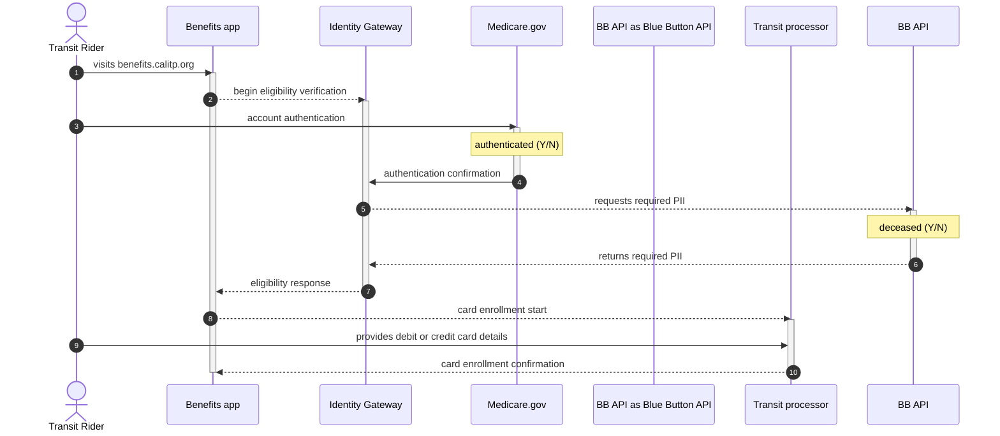

# Medicare cardholders

## Overview

This use case describes a feature in the [Cal-ITP Benefits app](https://benefits.calitp.org) that allows Californians to verify their active participation in the Medicare program to receive reduced fares for transit when paying by contactless debit or credit card at participating transit operators in California.

**Actor:** A person who uses public transit in California. For benefit eligibility, a Medicare cardholder is a person who has enrolled in the Medicare program, has a Medicare.gov account, and is not deceased.

**Goal:** To verify a transit rider’s Medicare status so they receive reduced fares when paying by contactless debit or credit card.

**Precondition:** The California transit operator offers fixed route service, has installed and tested validator hardware necessary to collect fares using contactless payment on bus or rail lines, and the operator has a policy in place to offer a transit discount to riders enrolled in Medicare.

## Demonstration

This video demonstrates how a Medicare enrollee uses the Cal-ITP Benefits web application to confirm their eligibility for a transit benefit using Medicare.gov and then registers their contactless debit or credit card with either Littlepay or Switchio, the transit processor that manages fare calculation for the transit provider.

<iframe width="560" height="315" src="https://www.youtube-nocookie.com/embed/YZylD7oAbso?si=1aUb26LYDgkm_SCo" title="YouTube video player" frameborder="0" allow="accelerometer; autoplay; clipboard-write; encrypted-media; gyroscope; picture-in-picture; web-share" referrerpolicy="strict-origin-when-cross-origin" allowfullscreen></iframe>

## Basic Flow

1. The transit rider visits the web application at benefits.calitp.org in a browser on their desktop computer.

1. The transit rider chooses the transit operator that serves an area where they want to ride public transit.

1. The transit rider chooses to verify their eligibility as a person who is living and enrolled in Medicare.

1. The transit rider authenticates with their existing Medicare.gov account or, if they don’t have one, creates a Medicare.gov account using their Medicare card.

1. The Cal-ITP Benefits app interfaces with the [California Department of Technology Identity Gateway](https://digitalidstrategy.cdt.ca.gov/primary-elements.html) (IdG) to verify benefit eligibility. The IdG uses successful authentication with Medicare.gov and personal information shared by the [Blue Button API](https://bluebutton.cms.gov/) to verify Medicare status.

1. The IdG uses the response provided by Blue Button API to determine the rider’s eligibility for a transit benefit.

1. The IdG then passes an eligibility response as Medicare enrollment status = TRUE to the Cal-ITP Benefits app to indicate the person is eligible for a benefit.

1. The transit rider provides the debit or credit card details they use to pay for transit to the transit processor that facilitates fare collection for the transit provider.

1. The app registers the transit benefit with the transit rider’s debit or credit card.

## Alternative Flows

- Suppose the transit rider does not have a desktop computer. In this case, they open the web application at benefits.calitp.org in a mobile browser on their iOS or Android tablet or mobile device to complete enrollment using the basic flow.

- Suppose the transit rider cannot authenticate with Medicare.gov, or will not create an account. In either case, the app cannot determine their Medicare status and they cannot enroll their contactless debit or credit card for a reduced fare.

- Suppose the CDT Identity Gateway returns Medicare enrollment status = FALSE. In that case, the Cal-ITP Benefits app will not allow the transit rider to enroll their contactless debit or credit card for a reduced fare.

- Suppose the debit or credit card expires or is canceled by the issuer. In that case, the transit rider must repeat the basic flow to register the new debit or credit card.

- If the transit rider uses more than one debit or credit card to pay for transit, they repeat the basic flow for each card.

## Postcondition

The transit rider receives a fare reduction each time they use the debit or credit card they registered to pay for transit rides. The number of times they can use the card to pay for transit is unlimited and the benefit never expires.

## Benefits

- The transit rider no longer needs cash to pay for transit rides.

- The transit rider doesn’t have to lock up funds on a closed-loop card offered by the transit operator.

- The transit rider pays for transit rides with their debit or credit card, just as they do for groceries, a cup of coffee, or any other good or service.

- The transit rider can enroll in a transit benefit from home when convenient; they do not have to visit a transit agency in person.

- Secure state and federal solutions manage the transit rider’s personal identifiable information (PII): Medicare.gov, the Blue Button API, and the California Department of Technology Identity Gateway (IdG). Transit riders do not have to share personal information with local transit operators.

- Benefit enrollment takes minutes rather than days or weeks.

- Benefit enrollment doesn’t require online accounts with private companies.

## Example Scenario

A 46-year old person with End-Stage Renal Disease (ESRD) uses public transit to get to and from dialysis treatments. They have undergone dialysis treatments for the last four months and are now covered by Medicare. In order to save on transportation expenses, they scheduled an appointment with their local transit agency and made a special trip to complete the in-person eligibility process to qualify for reduced transit fares. They now receive a 50% fare reduction but have to pay for transit rides using the closed-loop card provided by the operator to receive the reduced fare. It’s frustrating and inconvenient to reload this closed-loop agency card in $10 payments every week, especially because they sometimes could use the money tied up on the card to make ends meet. In summary, this person pays for daily expenses using several forms of payment: their agency card for transportation and their debit card or cash for everything else.

The transit operator serving their region of California implements contactless payments on fixed bus routes throughout the service area. This rider opens the Cal-ITP Benefits web application at home, completes the workflow to digitally confirm they are enrolled in Medicare, and registers their debit card for reduced fares. Now, when they tap-to-pay when boarding the bus, they are automatically charged the reduced fare. They no longer need to use their closed-loop agency card to pay for transit and have complete access to all funds in their weekly budget.
