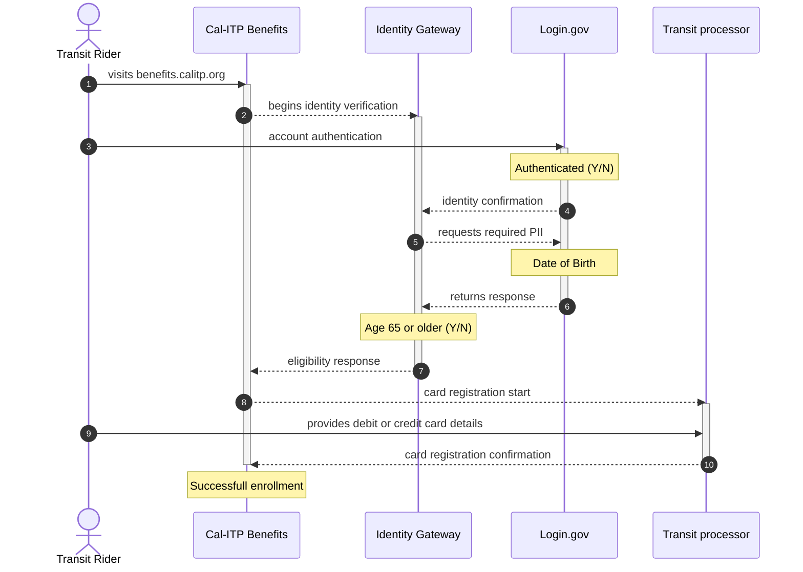
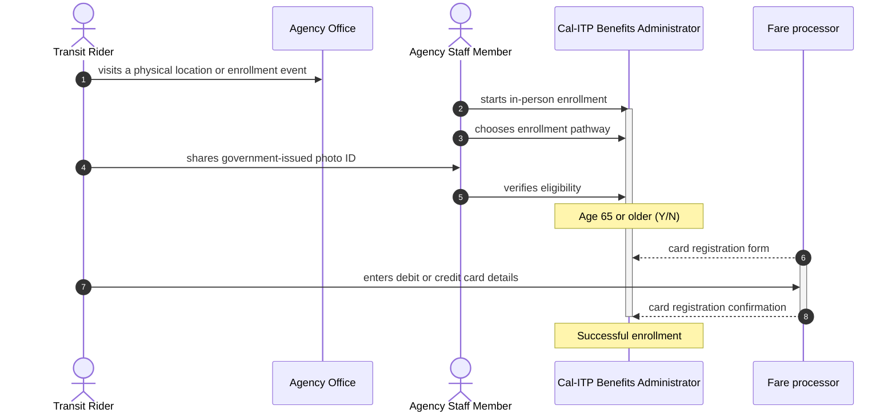

# Older adults

One Benefits application use case is for riders age 65 years and older. The Benefits application verifies the person's age to confirm eligibility and allows those eligible to enroll their contactless payment card for their transit benefit.

Currently, the app uses [Login.gov's Identity Assurance Level 2 (IAL2)](https://developers.login.gov/attributes/) to confirm age, which requires a person to have a Social Security number, a valid state-issued ID card and a phone number with a phone plan associated with the person's name. Adding ways to confirm eligibility for people without a Social Security number, for people who are part of a transit agency benefit program are on the roadmap.

## Demonstration

Here's a video walkthrough of the rider self-service enrollment experience when choosing the Older adult enrollment pathway.

<iframe width="560" height="315" src="https://www.youtube-nocookie.com/embed/vAJ_3lTeWJU?si=FCQX51zX_aaL556_&amp;controls=0" title="YouTube video player" frameborder="0" allow="accelerometer; autoplay; clipboard-write; encrypted-media; gyroscope; picture-in-picture; web-share" allowfullscreen></iframe>

## Self-service enrollment

1. The transit rider visits the web application at benefits.calitp.org in a browser on their desktop computer.

1. The transit rider chooses the transit operator that serves an area where they want to ride public transit.

1. The transit rider chooses to verify their eligibility as an older adult.

1. The Cal-ITP Benefits app interfaces with the [California Department of Technology Identity Gateway](https://digitalidstrategy.cdt.ca.gov/primary-elements.html) (IdG) to verify rider identity and benefit eligibility.

1. The transit rider authenticates with their Login.gov account or, if they don’t have one, creates one.

1. The transit rider consents to share information from their Login.gov account to verify their eligibility for a transit benefit.

1. The IdG uses the response provided by the Login.gov to determine the rider’s eligibility for a transit benefit.

1. The IdG then passes an eligibility response as older adult enrollment status = TRUE to the Cal-ITP Benefits app to indicate the person is eligible for a benefit.

1. The transit rider provides the debit or credit card details they use to pay for transit to the [transit processor](../../index.md#transit-processors) that facilitates fare collection for the transit provider.

1. The app registers the transit rider’s debit or credit card for reduced fares.

## Alternative self-service flows

- Suppose the transit rider does not have a desktop computer. In this case, they open the web application at benefits.calitp.org in a mobile browser on their iOS or Android tablet or mobile device to complete enrollment using the basic flow.

- Suppose the transit rider cannot authenticate with Login.gov, will not create an account, or cannot complete identity verification. In any of these cases, the app cannot determine their age and they cannot enroll their contactless debit or credit card for a reduced fare.

- Suppose the CDT Identity Gateway returns older adult enrollment status = FALSE. In that case, the Cal-ITP Benefits app will not allow the transit rider to enroll their contactless debit or credit card for a reduced fare.

- Suppose the debit or credit card expires or is canceled by the issuer. In that case, the transit rider must repeat the basic flow to register the new debit or credit card.

- If the transit rider uses more than one debit or credit card to pay for transit, they repeat the basic flow for each card.

## In-person enrollment

1. The transit rider visits an agency office or enrollment event in person.

1. A transit agency staff member logs into Cal-ITP Benefits Administrator, typically on a tablet device.

1. The transit agency staff member launches in-person enrollment and chooses Older adult as the eligibility type.

1. The transit rider hands the transit agency staff member their government-issued photo ID.

1. The transit agency staff member confirms the person’s identity and verifies the person is age 65 or older.

1. The transit agency staff member hands the transit rider the tablet so they can enter the debit or credit card details for the card they use to pay for transit.

1. The app registers the transit rider’s debit or credit card with the [transit processor](../../index.md#transit-processors).
