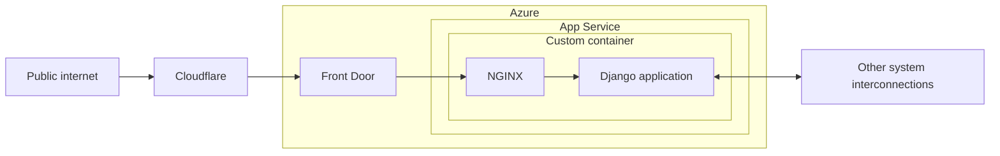
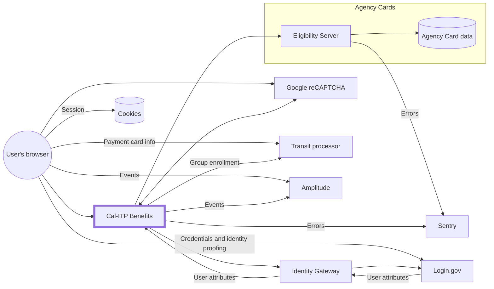

# Infrastructure

The infrastructure is configured as code via [Terraform](https://www.terraform.io/), for [various reasons](https://techcommunity.microsoft.com/t5/fasttrack-for-azure/the-benefits-of-infrastructure-as-code/ba-p/2069350).

## Getting started

Since the Benefits app is deployed into a Microsoft Azure account provided by the California Department of Technology (CDT)'s Office of Enterprise Technology (OET) team, you'll need to request access from them to the `CDT Digital CA` directory so you can get into the [Azure portal](https://portal.azure.com), and to the `California Department of Technology` directory so you can access [Azure DevOps](https://calenterprise.visualstudio.com/CDT.OET.CAL-ITP).

The Azure portal is where you can view the infrastructure resources for Benefits. Azure DevOps is where our [infrastructure pipeline](https://github.com/cal-itp/benefits/blob/main/terraform/azure-pipelines.yml) is run to build and deploy those infrastructure resources.

## Environments

Within the `CDT Digital CA` directory, there are two [Subscriptions](https://learn.microsoft.com/en-us/microsoft-365/enterprise/subscriptions-licenses-accounts-and-tenants-for-microsoft-cloud-offerings?view=o365-worldwide#subscriptions), with Resource Groups under each. (Refer to Azure's documentation for [switching directories](https://learn.microsoft.com/en-us/azure/devtest/offer/how-to-change-directory-tenants-visual-studio-azure).)

Each of our environments corresponds to a single Resource Group, [Terraform Workspace](https://developer.hashicorp.com/terraform/language/state/workspaces), and branch.

| Environment | Subscription          | Resource Group                | Workspace | Branch |
| ----------- | --------------------- | ----------------------------- | --------- | ------ |
| Dev         | `CDT/ODI Development` | `RG-CDT-PUB-VIP-CALITP-D-001` | `dev`     | `main` |
| Test        | `CDT/ODI Development` | `RG-CDT-PUB-VIP-CALITP-T-001` | `test`    | `test` |
| Prod        | `CDT/ODI Production`  | `RG-CDT-PUB-VIP-CALITP-P-001` | `default` | `prod` |

All resources in these Resource Groups should be reflected in Terraform in this repository. The exceptions are:

- Secrets, such as values under [Key Vault](https://azure.microsoft.com/en-us/services/key-vault/). [`prevent_destroy`](https://developer.hashicorp.com/terraform/tutorials/state/resource-lifecycle#prevent-resource-deletion) is used on these Resources.
- [Things managed by DevSecOps](#ownership)

### Ownership

The following things in Azure are managed by the California Department of Technology (CDT)'s DevSecOps (OET) team:

- Subcriptions
- [Resource Groups](https://learn.microsoft.com/en-us/azure/azure-resource-manager/management/manage-resource-groups-portal)
- Networking
- Front Door
  - Web Application Firewall (WAF)
  - Distributed denial-of-service (DDoS) protection
- IAM
- Service connections

You'll see these referenced in Terraform as [data sources](https://developer.hashicorp.com/terraform/language/data-sources), meaning they are managed outside of Terraform.

## Architecture

These diagrams show a high-level view of the architecture per environment, including some external systems (e.g. analytics, error monitoring, eligibility servers).

### Benefits application



[Front Door](https://docs.microsoft.com/en-us/azure/frontdoor/front-door-overview) also includes the [Web Application Firewall (WAF)](https://docs.microsoft.com/en-us/azure/web-application-firewall/afds/afds-overview) and handles TLS termination. Front Door is managed by the DevSecOps team.

### System interconnections



## Naming conventions

The DevSecOps team sets the following naming convention for Resources:

```
<<Resource Type>>-<<Department>>-<<Public/Private>>-<<Project Category>>-<<Project Name>>-<<Region>><<OS Type>>-<<Environment>>-<<Sequence Number>>
```

### Sample Names

- `RG-CDT-PUB-VIP-BNSCN-E-D-001`
- `ASP-CDT-PUB-VIP-BNSCN-EL-P-001`
- `AS-CDT-PUB-VIP-BNSCN-EL-D-001`

### Resource Types

Use the following shorthand for conveying the Resource Type as part of the Resource Name:

| Resource         | Convention |
| ---------------- | ---------- |
| App Service      | `AS`       |
| App Service Plan | `ASP`      |
| Virtual Network  | `VNET`     |
| Resource Group   | `RG`       |
| Virtual Machine  | `VM`       |
| Database         | `DB`       |
| Subnet           | `SNET`     |
| Front Door       | `FD`       |

## Making changes

### Set up for local development

1. [Get access to the Azure account through the DevSecOps team.](#getting-started)
1. Rebuild and launch the [dev container](development/README.md)
1. Navigate to the [`terraform/`](https://github.com/cal-itp/benefits/tree/main/terraform) directory.
1. [Authenticate using the Azure CLI](https://registry.terraform.io/providers/hashicorp/azurerm/latest/docs/guides/azure_cli).

   ```sh
   az login
   ```

1. [Initialize Terraform.](https://www.terraform.io/cli/commands/init) You can also use this script later to switch between [environments](#environments).

   ```sh
   ./init.sh <env>
   ```

1. Create a local `terraform.tfvars` file (ignored by git) from the sample; fill in the `*_OBJECT_ID` variables with values from the Azure Pipeline definition.

### Development process

When configuration changes to infrastructure resources are needed, they should be made to the resource definitions in Terraform and submitted via pull request.

1. Make changes to Terraform files.
1. Preview the changes, as necessary.

   ```sh
   terraform plan
   ```

1. [Submit the changes via pull request.](development/commits-branches-merging.md)

!!! info "Azure tags"

    For Azure resources, you need to [ignore changes](https://www.terraform.io/language/meta-arguments/lifecycle#ignore_changes) to tags, since they are [automatically created by an Azure Policy managed by CDT](https://docs.microsoft.com/en-us/azure/azure-resource-manager/management/tag-policies).

    ```hcl
    lifecycle {
        ignore_changes = [tags]
    }
    ```

### Infrastructure pipeline

[](https://calenterprise.visualstudio.com/CDT.OET.CAL-ITP/_build/latest?definitionId=828&branchName=dev)

When code is pushed to any branch on GitHub, our infrastructure pipeline in Azure DevOps runs [`terraform plan`](https://www.terraform.io/cli/commands/plan). When the pull request is merged into `main`, the pipeline runs [`terraform apply`](https://www.terraform.io/cli/commands/apply).

While other automation for this project is done through GitHub Actions, we use an Azure Pipeline for a couple of reasons:

- Easier authentication with the Azure API using a service connnection
- Log output is hidden, avoiding accidentally leaking secrets

## Azure environment setup

These steps were followed when setting up our Azure deployment for the first time:

- CDT team creates the [resources that they own](#ownership)
- `terraform apply`
- Set up Slack notifications by [creating a Slack email](https://slack.com/help/articles/206819278-Send-emails-to-Slack) for the [#notify-benefits](https://cal-itp.slack.com/archives/C022HHSEE3F) channel, then [setting it as a Secret in the Key Vault](https://learn.microsoft.com/en-us/azure/key-vault/secrets/quick-create-portal#add-a-secret-to-key-vault) named `slack-benefits-notify-email`
- Set required [App Service configuration](../reference/environment-variables.md) and [configuration](../tutorials/load-sample-data.md) by setting values in Key Vault (the mapping is defined in [app_service.tf](https://github.com/cal-itp/benefits/blob/main/terraform/app_service.tf))

This is not a complete step-by-step guide; more a list of things to remember. This may be useful as part of [incident response](https://docs.google.com/document/d/1qtev8qItPiTB4Tp9FQ87XsLtWZ4HlNXqoe9vF2VuGcY/edit#).
