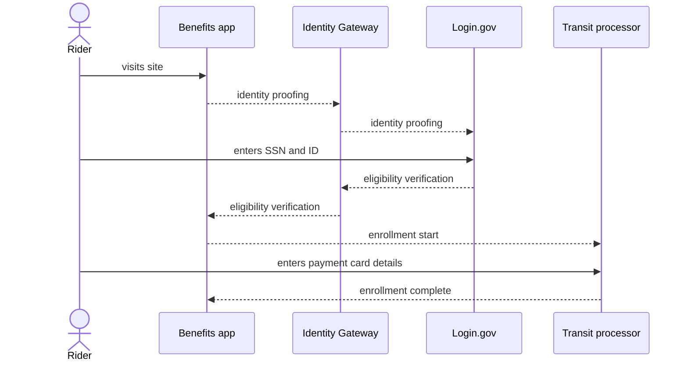

# Older adults

One Benefits application use case is for riders age 65 years and older. The Benefits application verifies the person's age to confirm eligibility and allows those eligible to enroll their contactless payment card for their transit benefit.

Currently, the app uses [Login.gov's Identity Assurance Level 2 (IAL2)](https://developers.login.gov/attributes/) to confirm age, which requires a person to have a Social Security number, a valid state-issued ID card and a phone number with a phone plan associated with the person's name. Adding ways to confirm eligibility for people without a Social Security number, for people who are part of a transit agency benefit program are on the roadmap.

## Demonstration

Here's a video showing what the flow looks like for an older adult to confirm their eligibility for a transit benefit through Login.gov and then register their contactless debit or credit card with Littlepay, one of the supported transit processors:

<iframe width="560" height="315" src="https://www.youtube-nocookie.com/embed/vAJ_3lTeWJU?si=FCQX51zX_aaL556_&amp;controls=0" title="YouTube video player" frameborder="0" allow="accelerometer; autoplay; clipboard-write; encrypted-media; gyroscope; picture-in-picture; web-share" allowfullscreen></iframe>

## Process

