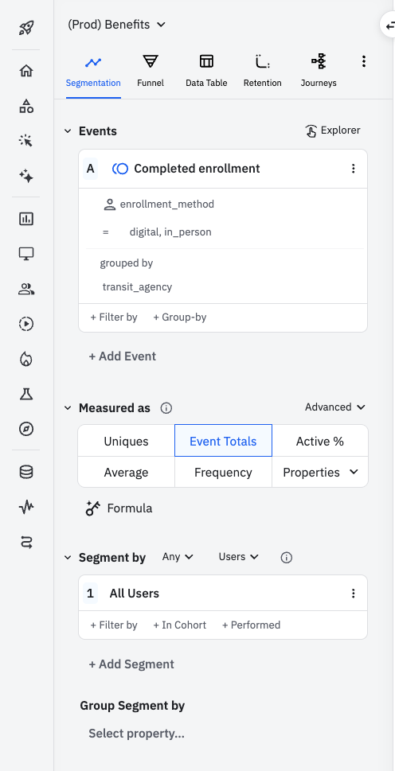
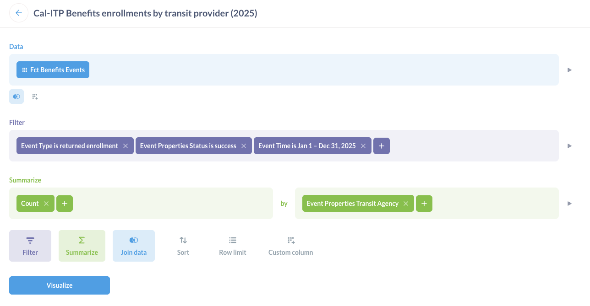

# Post-launch

## Verify real user enrollments are starting to happen

### Amplitude

{ align=right }

We consider a transit provider officially onboarded to Cal-ITP Benefits when the transit provider appears in our metrics. Specifically, the transit provider is onboarded when we see one or more complete enrollments for that transit provider in [Amplitude](https://amplitude.com/).

Use this query to confirm:

- **Segment:** All Users
- **Measured as:** Event Totals
- **Events:** Completed enrollment
  - User property `enrollment_method`: `digital`, `in_person`
  - Grouped by: `transit_agency`

You can also go directly to the existing [Enrollments by transit provider](https://app.amplitude.com/analytics/compiler/chart/mccedr54/edit/o9xupwel) chart.

### Metabase { .clear }

Amplitude currently stores only a year of historical data, so we archive all Cal-ITP data in [Metabase](https://www.metabase.com/). Thus, we also need to ensure metrics for the new transit provider are successfully piped from Amplitude to Metabase.

Use this query to confirm:

- **Data:** Fct Benefits Events
- **Filter:**
  - Event Type is returned enrollment
  - Event Properties Status is success
  - Event Time is [some date range that includes the dates you're expecting to see data for the new transit provider]
- **Summarize:** Count by Event Properties Transit Agency

You can also go directly to the existing [Cal-ITP Benefits enrollments by transit provider 2025](https://dashboards.calitp.org/question/3762-cal-itp-benefits-enrollments-by-transit-provider-2025) chart.

Once the transit provider is live in production, there are some cleanup steps to take.

_These items can all be done in parallel, and can also be done in parallel with the analytics verification described above._

## Update transit provider configuration in test environment

The transit provider's configuration in the test environment should be updated to change the production values back to the QA values for its steady state going forward.

=== "Littlepay"

    - Littlepay config
      - Environment
      - Audience
      - Client ID
      - Client secret [(update value in Azure Key Vault)](../../tutorials/secrets.md)
    - Littlepay groups:
      - Set group IDs back to the groups [created previously during development and testing configuration](#configuration-for-development-and-testing)
      - Once this is complete, verify that the setup is correct by using the [littlepay CLI](https://github.com/cal-itp/littlepay).

=== "Switchio"

    TK
