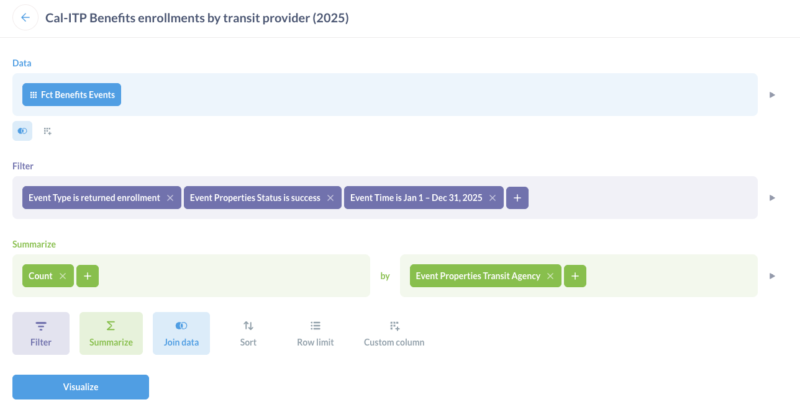

# Onboarding a new transit provider

This guide describes the steps needed to add support for a new transit provider to the application and take them from testing to production.

Before starting any configuration, the Cal-ITP team and transit provider staff should have a kickoff meeting to confirm that information provided is complete, implementation plan is feasible, and any approvals needed have been obtained.

Then, the following steps are done by the Cal-ITP team to configure a new transit provider in the Benefits application.

These steps currently assume the transit provider is using Littlepay as their transit processor. Support for integration with Switchio has been added but still needs to be documented, and integration with [other transit processors](https://www.camobilitymarketplace.org/contracts/) may be added in the future.

## Pre-configuration prep work

_These items can all be done in parallel._

### Create transit provider onboarding epic

_Typically performed by the Benefits Product Manager._

1. Navigate to the [Cal-ITP Benefits repository, Actions tab](https://github.com/cal-itp/benefits/actions)
2. Look in the left bar for the (pinned) workflow called `Agency Onboarding Issue Scaffold`, click on this to open the workflow run history
3. In the center view, on the top right, look for a drop-down button that says `Run workflow`, and click this
4. Leaving the branch selection the default (`main`), provide values for the other inputs (some of which are required)
5. Click the green `Run workflow` button under the input fields
6. Refresh the current page to see an in-progress workflow run, wait for it to finish with a green checkmark

Once the workflow runs successfully, the onboarding epic and all sub-issues will have been created based on the input data provided. They can be further edited, modified from the USB, etc. as normal.

### Add transit provider to adoption table

_Typically performed by the Benefits Product Manager._

Open a Pull Request adding the new transit provider to the table in the README, similar to this [example](https://github.com/cal-itp/benefits/pull/2944).

### Produce formatted transit provider logos

_Typically performed by a designer._

The application currently requires one transit provider logo for display on the landing page. The logo should be white with a clear background in the dimensions below:

- height: 64px
- width: any

### Update hardcoded parts of the application

_Typically performed by an engineer._

Certain parts of the codebase must be updated to support a new transit provider:

- [`benefits/core/context/agency.py`](https://github.com/cal-itp/benefits/blob/main/benefits/core/context/agency.py) (requires a [migration](../explanation/development/models-migrations.md))
- [`benefits/eligibility/views.py`](https://github.com/cal-itp/benefits/blob/main/benefits/eligibility/views.py)
- [`benefits/enrollment/context/flow.py`](https://github.com/cal-itp/benefits/blob/main/benefits/enrollment/context/flow.py)
- [Message files](../explanation/development/i18n.md)

[Here is an example PR that makes these updates for a new transit provider.](https://github.com/cal-itp/benefits/pull/3246)

## Configuration for development and testing

_These items can all be done in parallel._

### Initial Littlepay configuration

For development and testing, only a Littlepay customer group is needed since there is no need to interact with any discount product. (We don't have a way to tap a card against the QA system to trigger a discount and therefore have no reason to associate the group with any product.)

This work can begin once the transit provider has a contract in place with Littlepay.

- Cal-ITP uses the transit provider's Littlepay merchant ID to create a customer group in the Littlepay QA environment for each type of eligibility (e.g. senior).
  - _Typically performed by transit provider's Account Manager_
  - For each group that's created, a group ID will be returned and should be set as the `group_id` on a new `LittlepayGroup` in the Benefits database. (See [Configuration data](../tutorials/load-sample-data.md) for more on loading the database.)
- Cal-ITP requests and receives Littlepay Back Office API access (for both PROD and QA) for the new transit provider.
  - _Typically requested by a developer via email to Littlepay_

### Basic transit provider data configuration

--8<-- "inc/add-transitagency.md"
--8<-- "inc/add-enrollmentflow.md"

## Configuration for production validation

**Production validation** is the process of doing a end-to-end test of enrolling a real person's card through the Benefits app and using it to ride with a discounted fare. The word "production" here refers to **Littlepay's production environment** (which must be used to take a ride in real life), but the Benefits application's test environment is used for the enrollment process to avoid disruption of the Benefits production environment.

For production validation, both a customer group and discount product are needed. The customer group used here is a temporary one for testing only.

1. Transit provider staff creates the discount product in production Littlepay (if it does not already exist).
1. Transit provider staff takes a screenshot of the discount product in the Merchant Portal, making sure the browser URL is visible, and sends that to Cal-ITP.
1. Cal-ITP creates a customer group **for testing purposes** in production Littlepay.
1. Cal-ITP associates the group with the product.
   - _Typically performed by transit provider's Account Manager_
   - Once this is complete, verify that the setup is correct by using the [littlepay CLI](https://github.com/cal-itp/littlepay). Example:
   ```bash
   $ littlepay groups products
   👥 Matching groups (3): ⚠️  prod, edcta
   GroupResponse(id='b9634346-5a03-448d-8f7a-c7bec1169e00', label='Discounted', participant_id='eldorado-transit')
     🛒 Linked products (1)
     ProductResponse(id='56755aa9-0227-4208-a8a4-8b3217cebaa9', code='Daily Max - Discounted', status='ACTIVE', type='CAPPING', description='Daily Max - Discounted', participant_id='eldorado-transit')
   GroupResponse(id='f410db55-f1b5-49ef-8072-a5bbb685d0f5', label='Medicare', participant_id='eldorado-transit')
     🛒 Linked products (2)
     ProductResponse(id='b9f4b2aa-ecc2-4019-9552-03d7af4c484c', code='Medicare', status='ACTIVE', type='CAPPING', description='Medicare', participant_id='eldorado-transit')
     ProductResponse(id='05b43044-759d-4938-b150-2adc603e4f74', code='Medicare', status='ACTIVE', type='DISCOUNT', description='Medicare', participant_id='eldorado-transit')
   GroupResponse(id='e88042e2-7b56-4ffa-83b6-fa895a8e6a3d', label='Senior 65+', participant_id='eldorado-transit')
     🛒 Linked products (2)
     ProductResponse(id='267edc99-6989-4779-a445-94a121387a25', code='Senior 65+', status='ACTIVE', type='DISCOUNT', description='Senior 65+', participant_id='eldorado-transit')
     ProductResponse(id='d7d948c2-20bf-4b10-a181-d1f2c89456b6', code='Senior 65+', status='ACTIVE', type='CAPPING', description='Senior 65+', participant_id='eldorado-transit')
   ```
1. Cal-ITP ensures the code changes made [during development and testing configuration](#configuration-for-development-and-testing) are deployed to the test environment.

--8<-- "inc/add-transitagency.md"
--8<-- "inc/add-enrollmentflow.md"

1. Cal-ITP creates a new `EnrollmentGroup` in the Benefits test environment:
   - Choose one of the new `EnrollmentFlow`s.
   - Set the group value to the corresponding **testing** group ID (from production Littlepay) for production validation.
     - This will be set back to the QA group value after final production configuration is complete.
1. Cal-ITP creates a new `LittlepayConfig` in the Benefits test environment:
   - Set Environment to **Production** for production validation.
     - This will be set back to QA after final production configuration is complete.
   - Choose the new `TransitAgency`.
   - Retrieve Audience and Client ID values for the **production** config from shared LastPass note.
   - [Create the client secret in the Azure Key Vault](../tutorials/secrets.md) for the test environment, then paste its name in the Client Secret Name field.
     - Be sure to refresh the secrets for this to take effect!
       1. In the Azure portal, go to the App Service.
       1. Inside the App Service, navigate to Settings -> Environment variables.
       1. Click the **Pull reference values** button to force the App Service to bypass the 24-hour cache and fetch the latest values for Key Vault references. This triggers a graceful restart of the app.
1. Cal-ITP returns to the `TransitAgency` instance and checks the **Active** box.

At this point, Cal-ITP and transit provider staff can coordinate to do on-the-ground testing using the [test client](https://test-benefits.calitp.org) to enroll a real card and testing it by tapping on a live payment validator.

### Production validation testing

1. Transit provider staff (or Cal-ITP staff) does live test in the field.
1. Transit provider staff uses the Merchant Portal to verify the taps and discounts were successful.
1. Cal-ITP uses logs from Azure to verify the user was associated to the customer group.
1. Cal-ITP verifies that Amplitude analytic events are being sent.

## Configuration for production

Once production validation is done, the transit provider can be added to the production Benefits database.

1. Cal-ITP creates a customer group **for production use** in production Littlepay.
1. Cal-ITP associates the group with the discount product [created previously during production validation](#configuration-for-production-validation).
   - Once this is complete, verify that the setup is correct by using the [littlepay CLI](https://github.com/cal-itp/littlepay).
1. Cal-ITP ensures the code changes made [during development and testing configuration](#configuration-for-development-and-testing) are deployed to the prod environment.

--8<-- "inc/add-transitagency.md"
--8<-- "inc/add-enrollmentflow.md"

1. Cal-ITP creates a new `EnrollmentGroup` in the Benefits prod environment:
   - Choose one of the new `EnrollmentFlow`s.
   - Set the group value to the corresponding **production** group ID.
1. Cal-ITP creates a new `LittlepayConfig` in the Benefits prod environment:
   - Set Environment to **Production**.
   - Choose the new `TransitAgency`.
   - Retrieve Audience and Client ID values for the **production** config from shared LastPass note.
   - [Create the client secret in the Azure Key Vault](../tutorials/secrets.md) for the prod environment, then paste its name in the Client Secret Name field.
     - Be sure to refresh the secrets for this to take effect!
       1. In the Azure portal, go to the App Service.
       1. Inside the App Service, navigate to Settings -> Environment variables.
       1. Click the **Pull reference values** button to force the App Service to bypass the 24-hour cache and fetch the latest values for Key Vault references. This triggers a graceful restart of the app.
1. Cal-ITP returns to the `TransitAgency` instance and checks the **Active** box.

At this point, real customers can begin enrolling their cards and receiving their discounted fares with this transit provider!

## Verify real user enrollments are starting to happen

### Amplitude

{ align=right }

We consider a transit provider officially onboarded to Cal-ITP Benefits when the transit provider appears in our metrics. Specifically, the transit provider is onboarded when we see one or more complete enrollments for that transit provider in [Amplitude](https://amplitude.com/).

Use this query to confirm:

- **Segment:** All Users
- **Measured as:** Event Totals
- **Events:** Completed enrollment
  - User property `enrollment_method`: `digital`, `in_person`
  - Grouped by: `transit_agency`

You can also go directly to the existing [Enrollments by transit provider](https://app.amplitude.com/analytics/compiler/chart/mccedr54/edit/o9xupwel) chart.

### Metabase { .clear }

Amplitude currently stores only a year of historical data, so we archive all Cal-ITP data in [Metabase](https://www.metabase.com/). Thus, we also need to ensure metrics for the new transit provider are successfully piped from from Amplitude to Metabase.

Use this query to confirm:



- **Data:** Fct Benefits Events
- **Filter:**
  - Event Type is returned enrollment
  - Event Properties Status is success
  - Event Time is [some date range that includes the dates you're expecting to see data for the new transit provider]
- **Summarize:** Count by Event Properties Transit Agency

You can also go directly to the existing [Cal-ITP Benefits enrollments by transit provider 2025](https://dashboards.calitp.org/question/3762-cal-itp-benefits-enrollments-by-transit-provider-2025) chart.

## Cleanup

Once the transit provider is live in production, there are some cleanup steps to take.

_These items can all be done in parallel, and can also be done in parallel with the analytics verification described above._

### Remove test group in production Littlepay

The customer group that was created in production Littlepay for testing purposes can be deleted.

### Update transit provider configuration in test environment

The transit provider's configuration in the test environment should be updated to change the production values back to the QA values for its steady state going forward.

- Littlepay config
  - Environment
  - Audience
  - Client ID
  - Client secret [(update value in Azure Key Vault)](../tutorials/secrets.md)
- Littlepay groups:
  - Set group IDs back to the groups [created previously during development and testing configuration](#configuration-for-development-and-testing)
  - Once this is complete, verify that the setup is correct by using the [littlepay CLI](https://github.com/cal-itp/littlepay).
