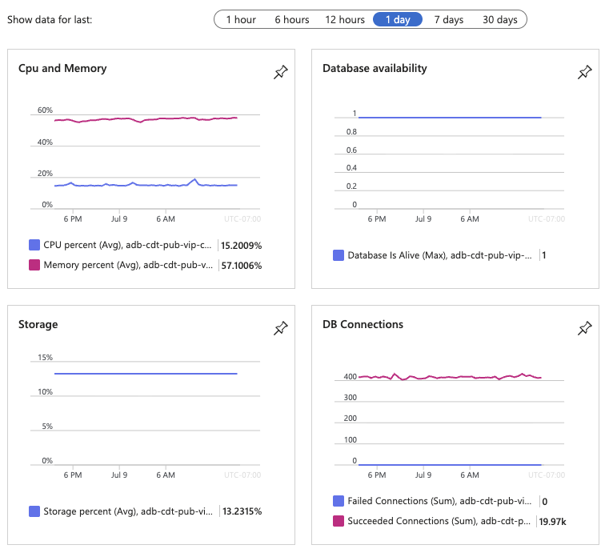

# PostgreSQL management

## Create a backup

When benefits was hosted as an application service, we downloaded a copy of the django.db sqlite file to backup the db prior to deploying new migrations.

Now we generate a .json export from PostgreSQL by running the command below from the container app console (accessible via Azure > Container App > Monitoring > Console).

```bash
python manage.py dumpdata --natural-foreign --natural-primary --indent=2 --output db_data.json
```

!!! info

    `--natural-foreign` and `--natural-primary` are used to avoid serialization issues with the permission and authentication Django objects.

## Restore from a backup

In order to restore from a .json backup, the commands below need to be run from the container app console (accessible via Azure > Container App > Monitoring > Console).

```bash
# blows away the existing db and runs migrations
python manage.py ensure_db --reset

# seeds data from the json backup
python manage.py loaddata db_data.json
```

## Monitor server health

The Overview page for Azure Database for PostgreSQL flexible server contains a variety of helpful charts to visualize the health of the hosted DB.



## Restart the server

The Overview page for Azure Database for PostgreSQL flexible server makes it possible to <kbd>↻ Restart</kbd> the db server.

## Provision

Provisioning for the db server is codified via [terraform][]. We currently use the Burstable compute tier with 32 GiB storage capacity and 3GiB RAM. See the [azurerm documentation](https://registry.terraform.io/providers/hashicorp/azurerm/latest/docs/resources/postgresql_flexible_server) for more information on configuring this service.

## Upgrade

We currently target PostgreSQL 17.x. When the time comes for a major version upgrade, the Overview page for Azure Database for PostgreSQL flexible server offers helpful utlities for both [validating and upgrading the database](https://learn.microsoft.com/en-us/azure/postgresql/configure-maintain/how-to-perform-major-version-upgrade?tabs=portal-major-version-upgrade).

Generally we expect that the steps will be as follows:

1. Perform a dry-run upgrade in azure to confirm that the db passes "Pre-upgrade validation"
1. Test locally with PostgreSQL 18.x to verify appropriate behavior in the application
1. Update `azurerm_postgresql_flexible_server` in [terraform][] and `terraform apply` to trigger the actual upgrade.

[terraform]: https://github.com/cal-itp/benefits/blob/3a930abe827601a8b541a0d464648f6d8979eb3a/terraform/database.tf#L11-L36
