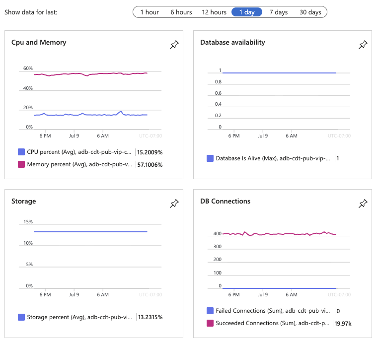

# PostgreSQL management

## Create a backup

When Benefits was hosted as an Application service, we downloaded a copy of the `django.db` SQLite file to backup the database prior to deploying new migrations. Now we generate a .json export from PostgreSQL.

The command (and all other commands in this guide) are run from the `-web` suffixed Container App console. It is accessible via Azure > Container App > Monitoring > Console > /bin/bash.

```bash
# writes the file to /calitp/app
python manage.py dumpdata --natural-foreign --natural-primary --indent=2 --output db_data.json
```

!!! info

    `--natural-foreign` and `--natural-primary` are used to avoid serialization issues with the permission and authentication Django objects.

## Copy a backup

To manage backups, use the app container's `web-storage` mounted volume.

```bash
# copy a backup into the mounted volume
cp /calitp/app/db_data.json /calitp/app/data/db_data_YYY_MM_DD.json

# copy a backup from the mounted volume
cp /calitp/app/data/db_data_YYY_MM_DD.json /calitp/app/db_data.json
```

You can view the files in the mounted volume (and upload new ones) by navigating to Azure > Storage account > Data storage > Classic file shares > `web-storage` > Browse.

## Restore from a backup

In order to restore from a .json backup, run the commands below from the Container App console.

```bash
# nuke existing data and rerun migrations
python manage.py ensure_db --reset

# seed data using the .json backup
python manage.py loaddata db_data.json
```

## Monitor server health

The Overview page for the "Azure Database for PostgreSQL flexible server" database service contains a variety of helpful charts to visualize the health of the hosted DB.



## Restart the server

The same Overview page can also be used to <kbd>↻ Restart</kbd> the database service.

## Provision

Provisioning for the database service is codified via [terraform][]. We currently use the Burstable compute tier with 32 GiB storage capacity, 1 vCore, and 2 GiB RAM. See the [azurerm documentation](https://registry.terraform.io/providers/hashicorp/azurerm/latest/docs/resources/postgresql_flexible_server) for more information on configuring this service.

## Upgrade

When the time comes for a major version upgrade, the Overview page for the database service also offers helpful utilities for [validating and upgrading the database](https://learn.microsoft.com/en-us/azure/postgresql/configure-maintain/how-to-perform-major-version-upgrade?tabs=portal-major-version-upgrade).

Generally we expect that the steps to be:

1. Perform a dry-run upgrade in azure to confirm that the db passes "Pre-upgrade validation"
1. Test locally with the same version of PostgreSQL to verify appropriate behavior in the application
1. Trigger the upgrade in Azure
1. Update `azurerm_postgresql_flexible_server` in [terraform][] and `terraform apply` to avoid reversion

## Use pgAdmin

pgAdmin provides a GUI to manage the PostgreSQL server. pgAdmin is setup slightly differently depending on the hosted environment.

### Local development environment

If this is your first time using pgAdmin or if you have recently cleared your associated Docker volume (`pgadmin_data`), you will need to register the PostgreSQL server:

1. Navigate to http://localhost:8081 (replace 8081 with your `PGADMIN_PORT` value if it was changed).
2. Select _Add New Server_ from the dashboard or navigate to _Object > Register > Server_.
3. Under the _General_ tab, provide any descriptive _Name_ for the server.
4. Under the _Connection_ tab, configure the following properties based on your environment variables:
   - _Host name/address_: Value of `POSTGRES_HOSTNAME` (usually `postgres`)
   - _Port_: Value of `POSTGRES_PORT` (usually `5432`)
   - _Maintenance database_: Value of `POSTGRES_DB` (usually `postgres`)
   - _Username_: Value of `POSTGRES_USER` (usually `postgres`)
   - _Password_: Value of `POSTGRES_PASSWORD` (usually `postgres`)
   - _Save password?_: Yes

Note that because `PGADMIN_CONFIG_SERVER_MODE=false`, pgAdmin runs in desktop mode which uses an automatic default login. After setting it up, you can start using pgAdmin to manage the database, e.g. going to _Servers > Name > Databases > django > Schemas > public > Tables_ to view the application's tables.

### Cloud environments

To use pgAdmin in any of the cloud environments:

1. Select the _pgAdmin Container App_ resource in Azure Portal.
2. Go to _Networking > Ingress > IP Restrictions_ and add your local public IP as an allowed _Source_.
3. Open pgAdmin by launching the Container App's _Application Url_.
4. On the pgAdmin landing page, use the value of the environment variable `PGADMIN_DEFAULT_EMAIL` for _Email Address / Username_ and the value of the `pgadmin-admin-password` secret for _Password_.

You can then start using pgAdmin to manage the database since the _Azure Database for PostgreSQL flexible server_ is already registered via Terraform, mostly through the configuration of the appropriate [pgAdmin environment variables](../reference/environment-variables.md#pgadmin).

[terraform]: https://github.com/cal-itp/benefits/blob/3a930abe827601a8b541a0d464648f6d8979eb3a/terraform/database.tf#L11-L36
