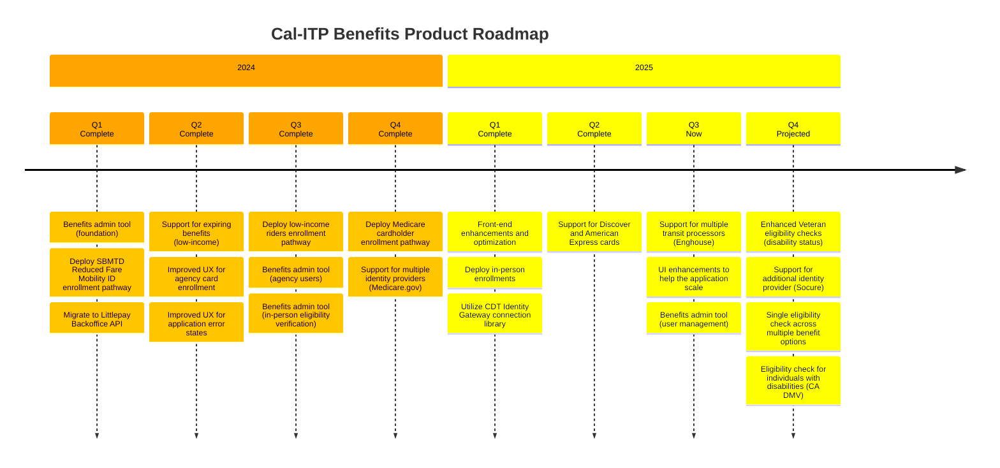

# Project overview

This website provides technical documentation for the [`benefits`][benefits-repo] application from the
[California Integrated Travel Project (Cal-ITP)][calitp].

[Cal-ITP Benefits](https://benefits.calitp.org) is a web application that enables digital eligibility verification and enrollment for transit benefits onto transit riders’ existing contactless debit and credit cards.

The development of this publicly-accessible client is being managed by Caltrans' California Integrated Travel Project (Cal-ITP), in partnership with the California Department of Technology (CDT). From the [Cal-ITP site](https://www.calitp.org/):

> Our Cal-ITP Benefits web application streamlines the process for transit riders to instantly qualify for and receive discounts, starting with Monterey-Salinas Transit (MST), which offers a half-price Senior Fare. Now older adults (65+) who are able to electronically verify their identity are able to access MST's reduced fares without the hassle of paperwork.
>
> We worked with state partners on this product launch, and next we're working to bring youth, lower-income riders, veterans, people with disabilities, and others the same instant access to free or reduced fares across all California transit providers, without having to prove eligibility to each agency.

Cal-ITP Benefits is open-source software that is designed, developed, and maintained by <a href="https://compiler.la/" target="_blank">Compiler LLC</a> on behalf of Caltrans, Cal-ITP, and our agency partners.

## Current work

We do sprint planning and track day-to-day work on our [Project Board][board].

## Product roadmap

Our product roadmap captures what we're currently building, what we've built, and what we plan to build in the future. We update it at the end of each quarter or when priorities change.

## Adoption by transit providers

The following California transit providers have adopted Cal-ITP Benefits. The benefit options available to eligible riders are denoted by a green checkmark.

| Transit provider                                | Initial launch date | Older adults | Medicare cardholders | U.S. Veterans | Agency card | Low-income |
| ----------------------------------------------- | ------------------- | ------------ | -------------------- | ------------- | ----------- | ---------- |
| **Monterey-Salinas Transit**                    | 12/2021             | ✅           | ✅                   | ✅            | ✅          | ―          |
| **Santa Barbara Metropolitan Transit District** | 10/2023             | ✅           | ✅                   | ―             | ✅          | ―          |
| **Sacramento Regional Transit District**        | 10/2024             | ✅           | ✅                   | ✅            | ―           | ―          |
| **Nevada County Connects**                      | 03/2025             | ✅           | ✅                   | ✅            | ―           | ―          |
| **Ventura County Transportation Commission**    | 10/2025             | ✅           | ✅                   | ―             | ―           | ―          |
| **San Luis Obispo Regional Transit**            | 12/2025             | ✅           | ✅                   | ―             | ―           | ―          |
| **El Dorado Transit Authority**                 | 01/2026 (target)    | \*           | \*                   | \*            | \*          | \*         |
| **Redding Area Bus Authority**                  | 01/2026 (target)    | \*           | \*                   | \*            | \*          | \*         |
| **City of San Luis Obispo**                     | 02/2026 (target)    | \*           | \*                   | \*            | \*          | \*         |
| **City of Roseville**                           | Planned             | \*           | \*                   | \*            | \*          | \*         |
| **Santa Cruz Metropolitan Transit District**    | Planned             | \*           | \*                   | \*            | \*          | \*         |

## Supported enrollment pathways

The Cal-ITP Benefits app supports the following enrollment pathways that use the corresponding eligibility verification methods:

| Enrollment pathway                   | Eligibility verification                                                              | Status | Launch               |
| ------------------------------------ | ------------------------------------------------------------------------------------- | ------ | -------------------- |
| [**Older adults**][older-adults]     | [Login.gov ID Proofed](https://developers.login.gov/attributes/)                      | Live   | [08/2022][2022.08.1] |
| [**Agency cards**][agency-cards]     | [Eligibility API](https://docs.calitp.org/eligibility-api/specification/)             | Live   | [11/2022][2022.11.1] |
| [**Veterans**][veterans]             | [Veteran Confirmation API](https://developer.va.gov/explore/api/veteran-confirmation) | Live   | [09/2023][2023.09.1] |
| [**Low-income**][low-income]         | CalFresh Confirm API                                                                  | Live   | [07/2024][2024.07.1] |
| [**Medicare cardholders**][medicare] | [Blue Button API](https://bluebutton.cms.gov/developers/#overview)                    | Live   | [09/2024][2024.09.3] |

## Technical and security details

`benefits` is a [Django 5][django] web application. The application talks to one or more [Eligibility Verification APIs](https://docs.calitp.org/eligibility-api/specification) or claims providers. These APIs and the application itself are
designed for privacy and security of user information:

- The API communicates with signed and encrypted JSON Web Tokens containing only the most necessary of user data for the purpose of eligibility verification
- The application requires no user accounts and stores no information about the user
- Interaction with the application is anonymous, with only minimal event tracking for usage and problem analysis

Running the application locally is possible with [Docker and Docker Compose][docker]. [Hosting information.][hosting]

The user interface and content is available in both English and Spanish. Additional language support is possible via Django's
[i18n and l10n features][i18n].

The application communicates with external [transit processor vendors](#transit-processors) via API calls and others like the [Identity Gateway](https://digitalidstrategy.cdt.ca.gov/primary-elements.html) via redirects, both over the public internet. See [all the system interconnections][interconnections].

### Infrastructure

The Benefits application is deployed to Microsoft Azure. Traffic is encrypted between the user and the application, as well as between the application and external systems.

The network is managed by the [California Department of Technology (CDT)](https://cdt.ca.gov/), who provide a firewall and [distributed denial-of-service (DDoS)](https://www.cloudflare.com/learning/ddos/what-is-a-ddos-attack/) protection.

You can find more technical details on [our infrastructure page](explanation/infrastructure.md).

### Data storage

The Benefits application doesn't collect or store any user data directly, and we minimize the information exchanged between systems. The following information is temporarily stored in an encrypted session in the user's browser:

- The user's progress through an enrollment pathway
- Credentials for interacting with the eligibility verification services

Sensitive user information exists in the following places:

- To enroll for reduced fares as an older adult, U.S. Veteran, or Calfresh cardholder, riders need to [provide personal information to Login.gov](https://benefits.calitp.org/help#login-gov-verify).
- To enroll for reduced fares as a Medicare cardholder, riders need to [provide personal information to Medicare.gov](https://www.medicare.gov/basics/get-started-with-medicare).
- Eligible riders need to provide their contactless credit or debit card information to one of our [transit processors](#transit-processors), to register their card for reduced fares.

None of that information is accessible to the Benefits system/team.

Learn more about the security/privacy practices of some of our third-party integrations:

- [Amplitude](https://amplitude.com/amplitude-security-and-privacy)
- [Littlepay](https://littlepay.com/privacy-policy/)
- [Switchio](https://switchio.com/privacy-policy/)
- [Login.gov](https://www.login.gov/policy/)

Benefits collects analytics on usage, without any identifying information. You can find more details on [our analytics page](reference/analytics.md).

### Transit processors

The Benefits application integrates with transit processors to securely register credit or debit cards. This application currently supports the following transit processors:

- [Littlepay][littlepay]
- [Switchio][switchio]

### Practices

[Dependabot](https://github.com/features/security/software-supply-chain) immediately notifies the team of vulnerabilities in application dependencies.

Upon doing new major integrations, features, or architectural changes, the Benefits team has a penetration test performed by a third party to ensure the security of the system.

All code changes are reviewed by at least one other member of the engineering team, which is enforced through [branch protections](https://docs.github.com/en/repositories/configuring-branches-and-merges-in-your-repository/defining-the-mergeability-of-pull-requests/about-protected-branches).

[2022.08.1]: https://github.com/cal-itp/benefits/releases/tag/2022.08.1
[2022.11.1]: https://github.com/cal-itp/benefits/releases/tag/2022.11.1
[2023.09.1]: https://github.com/cal-itp/benefits/releases/tag/2023.09.1
[2024.07.1]: https://github.com/cal-itp/benefits/releases/tag/2024.07.1
[2024.09.3]: https://github.com/cal-itp/benefits/releases/tag/2024.09.3
[older-adults]: explanation/enrollment-pathways/older-adults.md
[agency-cards]: explanation/enrollment-pathways/agency-cards.md
[veterans]: explanation/enrollment-pathways/veterans.md
[low-income]: explanation/enrollment-pathways/low-income.md
[medicare]: explanation/enrollment-pathways/medicare-cardholders.md
[benefits-repo]: https://github.com/cal-itp/benefits
[board]: https://github.com/orgs/compilerla/projects/6/views/8
[calitp]: https://calitp.org
[django]: https://docs.djangoproject.com/en/
[docker]: https://www.docker.com/products/docker-desktop
[interconnections]: explanation/infrastructure.md#system-interconnections
[hosting]: explanation/deployment.md
[littlepay]: https://littlepay.com/
[switchio]: https://switchio.com/transport/
[i18n]: https://docs.djangoproject.com/en/5.0/topics/i18n/
