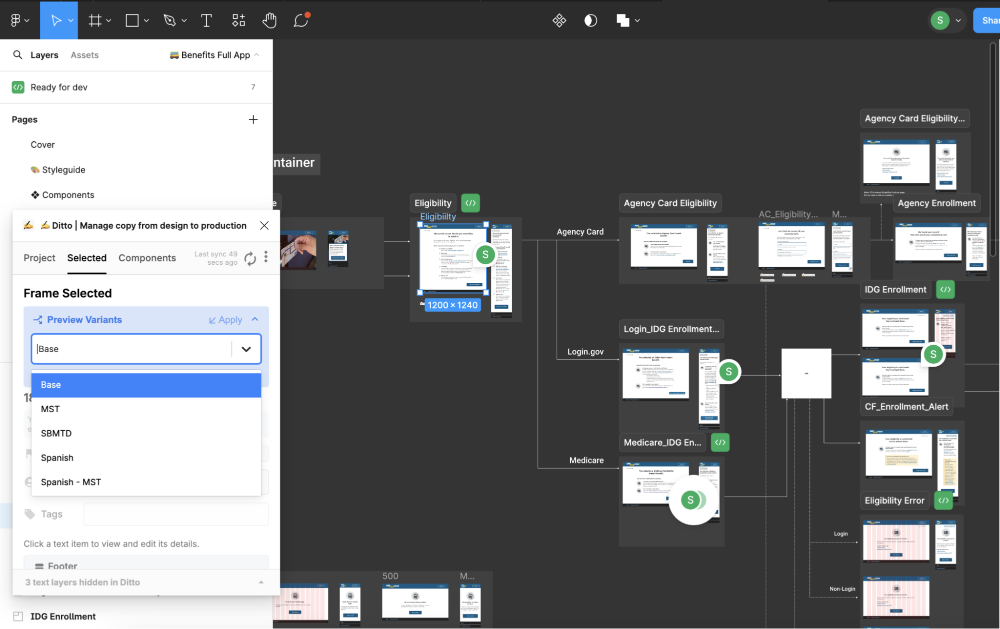
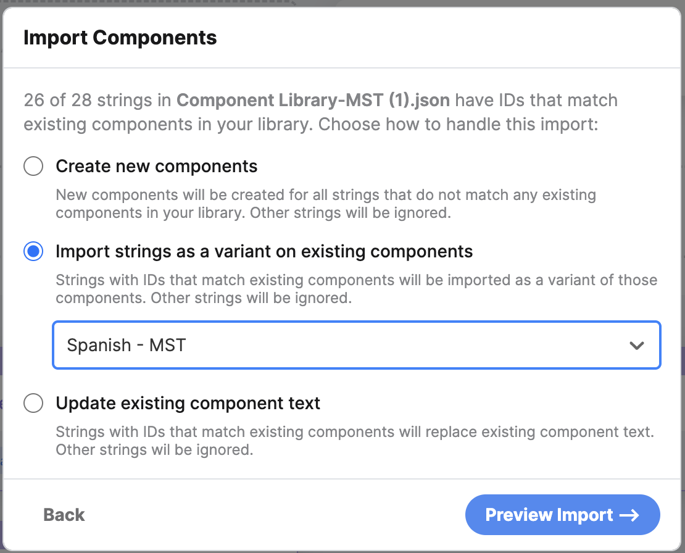

# Copy delivery process

## Summary

Design and Product use the tools Figma, Ditto, and Crowdin to craft product copy, manage all copy and variations of copy (e.g. agency-specific copy or Spanish translation copy), and translate copy. Developers then create and update `django.po` message files for each supported language from copy created and implemented by Design and Product.

At a high level, this is the process for creating and delivering copy:

1. In Figma all new design work, including copy, is done in a new branch.
1. Work with product and other designers to develop copy.
1. Present designs, including copy, via a Design Review with Product and Development.
1. Iterate as needed.
1. Sync all final copy with Ditto and Crowdin.
1. Submit copy for translation, and add to Ditto.
1. Hand off finalized work during a second meeting, called The Hand-Off wherein developers craft GitHub issues.
1. Once work is reviewed and approved, then Designers select Review and Merge Changes from the branch drop down menu.
1. Ensure all changes are accurate then merge.
1. Mark all screens with changes as _Ready for dev_.
1. If during implementation, developers note any typos or small mistakes they can comment in Figma to correct those. Engineers cannot ask design to change anything substantial after hand-off. That would be a new design process.

## The copy process for Designers

### Starts with design in Figma...

Always start a new branch when starting a new design project for an existing entity. This is especially important when working as a contractor for Compiler, so that the files are consistent for the developers.

If Developers have any comments or concerns regarding the copy, then Figma comments are the most appropriate place to record those. Comments can and should be made during the Design Review and subsequent iteration phase. All parties should make efforts to review and comment on copy during the Design Review phase.

### ...syncs between Figma and Ditto...

Syncing between Figma and Ditto is a straightforward process that allows Compiler folks to work either in Ditto or Figma depending on their permission levels, role, or preference. This means the copy can be considered the _source of truth_ in either Figma or Ditto and that copy can be exported or saved from either Ditto or Figma.

Syncing _within the Figma app_ occurs when opening the Ditto plugin while working in the **main branch** of your linked Figma file. You can resync by clicking the resync icon on the top right corner of the plugin window. When working in Ditto, resync with the file from the top navigation bar on the right side.

#### A note on syncing new copy in Ditto

1. **Merge all branch changes** in Figma first and **ensure the design work is finalized before** moving to Ditto and finalizing copy.
1. Sync Ditto in the app.
1. Review all new changes for accuracy.
1. Create and update components as needed.
1. Include variants on any new component as needed.

#### A note on branching in Ditto

Using branching in Ditto is still in Beta, and there's potential for losing work. The main branch in Ditto is also locked for work while the new branch is being worked on. This feels unnecessarily complicated, so Design recommends that all approval of designs and copy happens in a Figma branch--merge that branch with the main Figma file, then create any new components in Ditto (and go through the process of content localization) using the main Figma file. In other words, Design does not recommend using the branching process in Ditto.

#### A note on working primarily in Ditto

This documentation assumes that design work, including copy, is conducted in Figma first. If a designer is working only on adding or updating copy, they can work solely in Ditto. If this is your process, then ensure that you have synced with the main Figma branch after finishing your update.

#### A note on viewing Spanish copy and Spanish variants in Figma

For viewing copy in Spanish in Figma, a designer needs to have the Ditto plugin active. From there, select a frame and the Ditto plugin should automatically move to the Selected tab, and within that tab there's a dropdown to preview different variants.

### ...then syncs between Ditto and Crowdin for translations.

#### How to sync base text

Uploading base text from Ditto to Crowdin is an easy process. Open Crowdin. From within the Cal-ITP project, go to the Integrations tab, and then select the file from Ditto you would like to translate. Select the Sync to Crowdin button.

#### How to sync variants

Currently the Crowdin integration only exports the Base text from Ditto. So in order to have Crowdin essentially treat a variant in Ditto as base text that can get translated, we need to employ a manual workaround:

For translating variants, DO NOT use the Ditto <> Crowdin integration, but rather a manual upload and download process.

1. Export the variant text from Ditto as its own JSON file. From the component library, click the Export button. Select Flat JSON, and then the Variant you'd like in the dropdown, and export it.
1. Upload that export from Ditto into Crowdin. Go to Sources and manually drag the component library JSON files (e.g. MST and SBMTD) into the appropriate Crowdin file.
1. Compiler has an account with BabbleOn for translation services within the Crowdin platform. Currently we work with [Salim at BabbleOn](https://www.ibabbleon.com/team.html), and we email him and ask for the translations to be done in Crowdin. Product manages our relationship with BabbleOn.
1. After Salim has confirmed the translations are complete, then export the new translation out of Crowdin as a JSON file.
1. Upload that JSON file back into Ditto. Ditto should recognize that those strings already exist in your component library (via the component IDs), and allow you to assign the new translated text you're uploading to a variant. Create a new variant for the translation or attach to one you’ve already created (ex: MST-Spanish).

### Developers create or update Django.po files

After Product and Design have finalized their portion of the copy process, developers are able to create and update `django.po` message files for each supported language. The [`locale`](https://github.com/cal-itp/benefits/tree/main/benefits/locale) folder in this repository contains the `django.po` message files for English and Spanish translation strings for the Benefits application.

Translation strings include all application copy, including:

- All application copy
- Image and illustration alt tags
- Page titles used in the browser tab
- In-line link URLs
- Error messages (like [no script](https://github.com/cal-itp/benefits/blob/main/benefits/core/templates/core/includes/noscript.html), [no cookies](https://github.com/cal-itp/benefits/blob/main/benefits/core/templates/core/includes/nocookies.html) warnings)

Developers can retrieve all Spanish copy and Spanish variant copy (e.g. Spanish-MST) from Ditto.

## Copy delivery process responsibilities

### Design

- Collaborate with Product on copywriting.
- Draft, proof and ready the copy for review in Figma and Ditto.
- Ensure English language and Spanish language copy are edited according to client style guides when available.
- Ensure copy is synced between Figma, Ditto, and Crowdin.
- Engage with the translation agency, [BabbleOn](https://ibabbleon.com/), to get Spanish translations ready for Engineering.
- Deliver production-ready copy, with Spanish translations, to Engineering at Design Hand-Off meeting via a synced Figma file in the main branch.

### Product

- Engage with product stakeholders to get the information necessary for copywriting.
- Collaborate with Design on copy writing.
- Help verify English and Spanish copy is ready for Engineering.

### Engineering

- Move copy from Figma, properly synced with Ditto, into code in `django.po` message files. Developer-specific instructions in the [Django message files technical documentation](../development/i18n.md).
- Ensure the messages accurately reflect Figma/Ditto.

## Timeline

Design follows the sprint schedule set by Product and Engineering; however there is no standard number of sprints or time within a sprint dedicated to the copy process. Rather, the process timeline is determined by effort required.

Generally, Design will conduct research in an effort to determine parameters for the copy and to shape a first draft. Those parameters are then approved and/or finalized by Product. After that, Design then does a UX writing pass and further shapes the copy. Copy is reviewed by Product and then reviewed by Engineering during Design Review.

Engineering requests that the copy is finished and translated before the Hand-Off and before the next sprint starts (presumably the sprint the copy would be implemented in). Translating the copy takes about a week so it’s important to plan the Design Review and Hand-Off accordingly.

## Tools used

### Figma

Figma is our primary design tool and is the source of truth for all design decisions, concepts, and directions for the Benefits app and all Cal-ITP sites. Compiler has Figma Organization which includes developer mode, version history, and branching–a tool to explore new design directions.

The development team prefers not to have admin or editor capabilities so as not to accidentally interfere with any designs. Handoff of design files occurs over the course of two meetings: a review of the designs, and then hand-off or a chance for developers to create GitHub issues while designers can weigh in and answer questions (aka “issue fest”). After these meetings, designs are marked Ready for Dev within Figma.

The dev team and design largely collaborate on designs through Slack and comments directly in Figma. Design aims to address Figma comments as soon as possible or within one day.

### Ditto

The human-readable version of the English and Spanish translation strings for the application are delivered to Product and Engineering by Design, and are managed in the Ditto application. [Cal-ITP Benefits](https://app.dittowords.com/projects/65e119db3f806ee92198378a/page/5766:22626).

Ditto is Compiler’s copy management system for Benefits and the Cal-ITP sites. It syncs directly with Figma and uses many of the same conventions found in Figma, including components and variables (therefore, it is important to be specific when referring to a Ditto component or a Figma variable).

The Benefits project within Ditto is fully synced with Figma. Product and Design may use either Figma or Ditto as their source of truth on copy, though it is recommended that Developers use Figma for all final English copy. Spanish copy can be found in Ditto. Compiler is considering using the GitHub integration that comes with Ditto, but has not formally integrated Ditto into their workflow as of yet.

In the Benefits project, all of the text has been componentized. Agencies are represented in the text as variants on components. Languages are also represented in the text as variants.
Currently Benefits has two languages: English and Spanish. English is the assumed default in the copy in Ditto, and Spanish is a variant. There are variants within Ditto that include both an agency and Spanish, such as MST-Spanish.

### Crowdin

Crowdin is our translation platform. We use BabbleOn to provide our translations. With very simple translations (or more complex if you are fluent or native in the language), Compiler team members can translate the strings of text directly in the Crowdin platform. For anything above our language skills, Design contacts Salim at BabbleOn and asks for the new files to be translated once the language files have been synced from Ditto to Crowdin.
