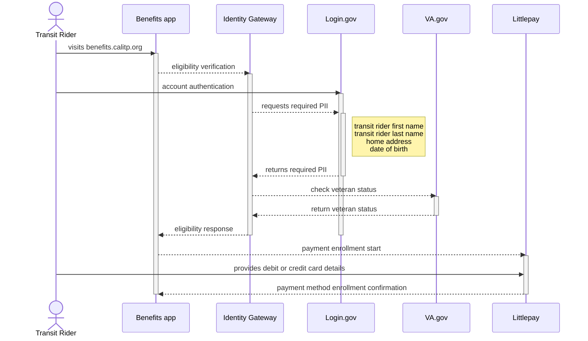

# Veterans enrollment pathway

## Overview

This use case describes a feature in the [Cal-ITP Benefits app](https://benefits.calitp.org) that allows US veterans who use public transit to verify their veteran status and receive reduced fares when paying by contactless debit or credit card at participating transit providers in California.

**Actor:** A US veteran who uses public transit in California. For benefit eligibility, a veteran is defined as “a person who served in the active military, naval, or air service, and was discharged or released therefrom under conditions other than dishonorable.” ([source](https://www.ssa.gov/OP_Home/comp2/D-USC-38.html))

**Goal:** To verify a transit rider’s veteran status and enable the rider to receive reduced fares when paying by contactless debit or credit card.

**Precondition:** The California transit provider delivering fixed route service has installed and tested validator hardware necessary to collect fares using contactless payment on bus or rail lines, and the provider has a policy to offer a transit discount for US veterans.

## Basic flow

1. The transit rider visits the web application at [benefits.calitp.org](https://benefits.calitp.org) in a browser on their desktop computer.
2. The transit rider chooses the transit provider that serves their area.
3. The transit rider selects the option to receive a reduced fare for veterans.
4. The transit rider authenticates with their existing [Login.gov](https://Login.gov) account or creates a [Login.gov](https://Login.gov) account if they don’t have one.
5. The Cal-ITP Benefits app interfaces with the [California Department of Technology](https://cdt.ca.gov/) Identity Gateway (IdG) to verify benefit eligibility. The IdG requests the required personal information to verify veteran status from [Login.gov](https://Login.gov).
6. The IdG utilizes the [Veteran Confirmation API](https://developer.va.gov/explore/api/veteran-confirmation) provided by the US Department of Veterans Affairs to determine the rider’s veteran status.
7. The IdG passes the response from [VA.gov](https://VA.gov) as veteran status = TRUE to the Cal-ITP Benefits app to indicate the person is eligible for a benefit.
8. The transit rider provides the debit or credit card details they use to pay for transit to Littlepay, the payment processor that facilitates transit fare collection.
9. The app registers the veteran benefit with the transit rider’s debit or credit card.

## Alternative flows

*   If the transit rider does not have a desktop computer, they can open the web application at [benefits.calitp.org](https://benefits.calitp.org) in a mobile browser on their iOS or Android tablet or mobile device to complete enrollment using the basic flow.
*   Suppose the transit rider cannot authenticate with [Login.gov](https://Login.gov), or will not create an account. In either case, the app cannot determine their veteran status and, thus, cannot enroll their contactless debit or credit card for a reduced fare.
*   If [VA.gov](http://VA.gov) determines the person does not meet the definition of a veteran (IdG returns a veteran status of FALSE), the Cal-ITP Benefits app will not allow the transit rider to enroll their contactless debit or credit card for a reduced fare.
*   If the debit or credit card expires or is canceled by the issuer, the transit rider must repeat the basic flow to register a new debit or credit card.
*   If the transit rider uses more than one debit or credit card to pay for transit, they repeat the basic flow for each card.

## Postcondition

The transit rider receives a fare reduction each time they use the debit or credit card they registered to pay for transit rides. The number of times they can use the card to pay for transit is unlimited and the benefit never expires. 

## Benefits

*   The transit rider no longer needs cash to pay for transit rides.
*   The transit rider doesn’t have to lock up funds on a closed-loop card offered by the transit provider.
*   The transit rider pays for transit rides with their debit or credit card, just as they pay for any other good or service that accepts contactless payment.
*   The transit rider can enroll in a transit benefit from home when convenient; they do not have to visit a transit provider in person.
*   Secure state and federal solutions manage the transit rider’s personal identifiable information (PII): [Login.gov](https://Login.gov) and the California Department of Technology Identity Gateway (IdG). Transit riders do not have to share personal information with local transit agencies.
*   Benefits enrollment takes minutes rather than days or weeks.

## Example scenario

A veteran in California uses public transit regularly. They don’t have a car and depend on buses to get to appointments and do errands that take too long to use their bicycle. They receive a 50% fare reduction for being a US veteran but have to pay for transit rides using the closed loop card provided by the agency to receive the reduced fare. It’s frustrating and inconvenient to reload this agency card in $10 payments every week, especially because they sometimes need the money tied up on the card to pay for groceries and medication. 

The transit provider serving their part of California implements contactless payments on fixed bus routes throughout the service area. This rider uses [benefits.calitp.org](https://benefits.calitp.org) to confirm their veteran status and register their debit card for reduced fares. They tap to pay when boarding buses in their area and are automatically charged the reduced fare. They no longer need to carry one card to pay for transit and another for other purchases. Best of all, they have complete access to all funds in their weekly budget. If food and medication costs are higher one week, they can allocate additional funds to those areas and ride transit less.
