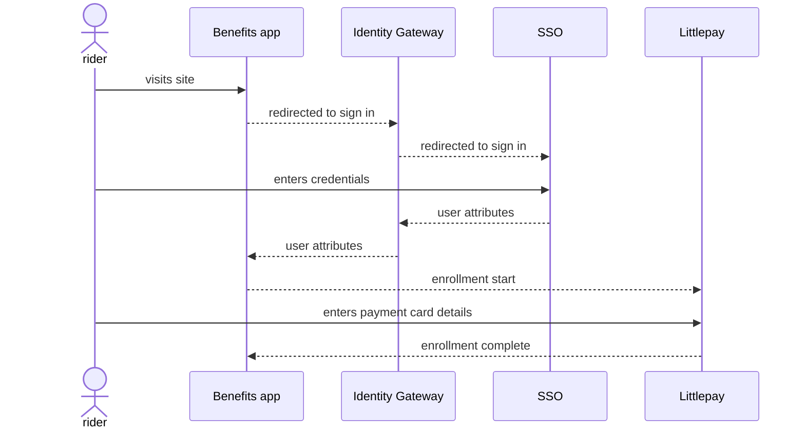

# College Discount

We have another potential transit discount use case, which is for students/faculty/staff from the Monterey-Salinas Transit (MST) area. We will be taking [the existing program](https://mst.org/fares/overview/) where students from certain schools ride free, expanding it to faculty and staff in some cases, and allowing those riders to enroll their contactless bank (credit/debit) cards for half-price (50%) discounts during fall and winter breaks.

## Prototype

Here's a clickable prototype showing what the flow might look like, having users enroll via their college's single sign-on (SSO) system:

<iframe style="border: 1px solid rgba(0, 0, 0, 0.1);" width="800" height="700" src="https://www.figma.com/embed?embed_host=share&url=https%3A%2F%2Fwww.figma.com%2Fproto%2FSeSd3LaLd6WkbEYhmtKpO3%2FBenefits-(Identity-Verification-SSO)%3Fnode-id%3D7741%253A33063%26scaling%3Dscale-down%26page-id%3D7741%253A32852%26starting-point-node-id%3D7741%253A33063" allowfullscreen></iframe>

## Process

Here's what might happen behind the scenes in a success flow:

The plan is to determine whether the rider is eligible via SAML attributes and/or membership in a group on the college side.
