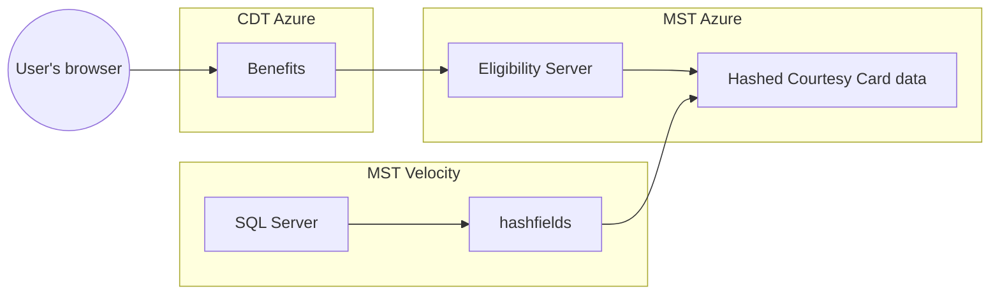

# Courtesy Cards

Courtesy Cards are [a reduced fare program from Monterey-Salinas Transit (MST)](https://mst.org/riders-guide/how-to-ride/courtesy-card/). We more generically refer to these "agency cards", in that they are issued by a transit agency. They are different from our other use cases in that eligibility verification happens on the agency side (offline) rather than through the Benefits app, and the Benefits app then checks for a valid Courtesy Card via an [Eligibility API call](https://docs.calitp.org/eligibility-api/specification/).

## Architecture

Notes:

- [Eligibility Server documentation](https://docs.calitp.org/eligibility-server/)
- [More details about the Benefits architecture](../deployment/infrastructure/#architecture)
- Velocity is the system MST uses to manage Courtesy Cards
