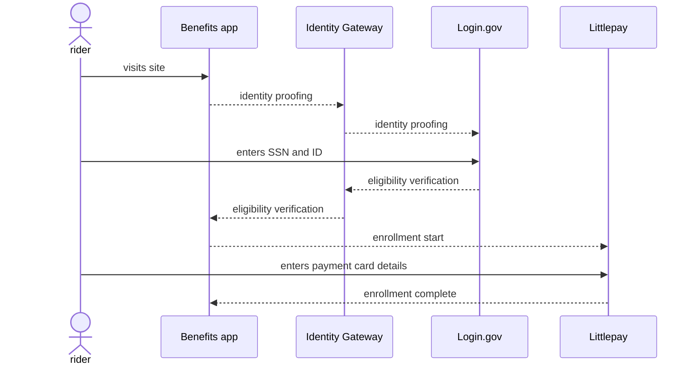

# Seniors

One Benefits application use case is for riders age 65 years and older. The Benefits application verifies the person's age to confirm eligibility and allows those eligible to enroll their contactless payment card for their transit benefit.

Currently, the app uses [Login.gov's Identity Assurance Level 2 (IAL2)](https://developers.login.gov/attributes/) to confirm age, which requires a person to have a Social Security number, a valid state-issued ID card and a phone number with a phone plan associated with the person's name. Adding ways to confirm eligibility for people without a Social Security number, for people who are part of of a transit agency benefit program are on the roadmap.

## Prototype

Here's a clickable prototype that shows what the flow looks like, having seniors confirm eligibility via Login.gov and enroll via LittlePay:

<iframe style="border: 1px solid rgba(0, 0, 0, 0.1);" width="800" height="800" src="https://www.figma.com/embed?embed_host=share&url=https%3A%2F%2Fwww.figma.com%2Fproto%2FSeSd3LaLd6WkbEYhmtKpO3%2FBenefits-(IAL2-Login.gov)%3Fnode-id%3D4551%253A4180%26scaling%3Dscale-down%26page-id%3D4551%253A4111%26starting-point-node-id%3D4551%253A4180" allowfullscreen></iframe>

## Process

