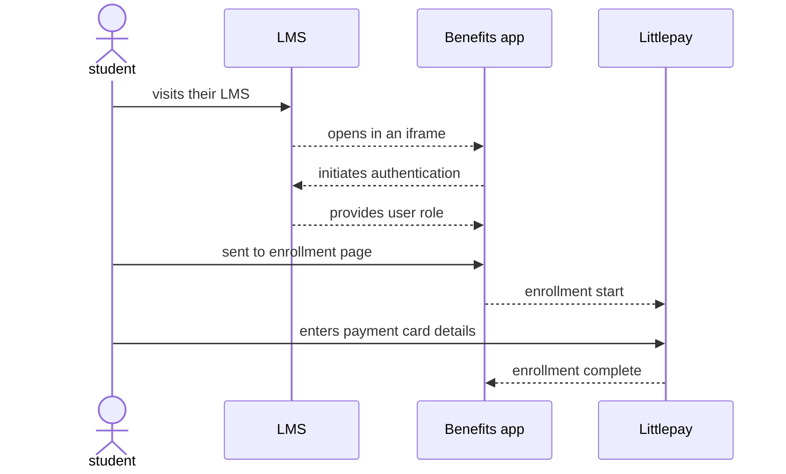

# Students

We have another potential transit discount use case, which is for college students from the Monterey-Salinas Transit (MST) area. We will be taking [the existing program](https://mst.org/fares/overview/) where students from certain schools ride free, and allowing those students to enroll their contactless bank (credit/debit) cards.

## Prototype

Here's a clickable prototype showing what the flow might look like, having students enroll via their college's Learning Management System (LMS):

<iframe style="border: 1px solid rgba(0, 0, 0, 0.1);" width="800" height="800" src="https://www.figma.com/embed?embed_host=share&url=https%3A%2F%2Fwww.figma.com%2Fproto%2FSeSd3LaLd6WkbEYhmtKpO3%2FBenefits-(IAL2-Login.gov)%3Fnode-id%3D4688%253A16407%26scaling%3Dscale-down%26page-id%3D4684%253A15737%26starting-point-node-id%3D4688%253A16407" allowfullscreen></iframe>

## Process

Here's what might happen behind the scenes in a success flow:

The current plan is for Benefits application to be integrated with each school's LMS as an [LTI 1.3](http://www.imsglobal.org/spec/lti/v1p3/) tool. Authentication would happen through [OpenID Connect](https://openid.net/specs/openid-connect-core-1_0.html#Overview) via an [anonymous launch](http://www.imsglobal.org/spec/lti/v1p3/#anonymous-launch-case). The hope is that we can infer the rider is an eligible student via their [role in the LMS](http://www.imsglobal.org/spec/lti/v1p3/#role-vocabularies).
