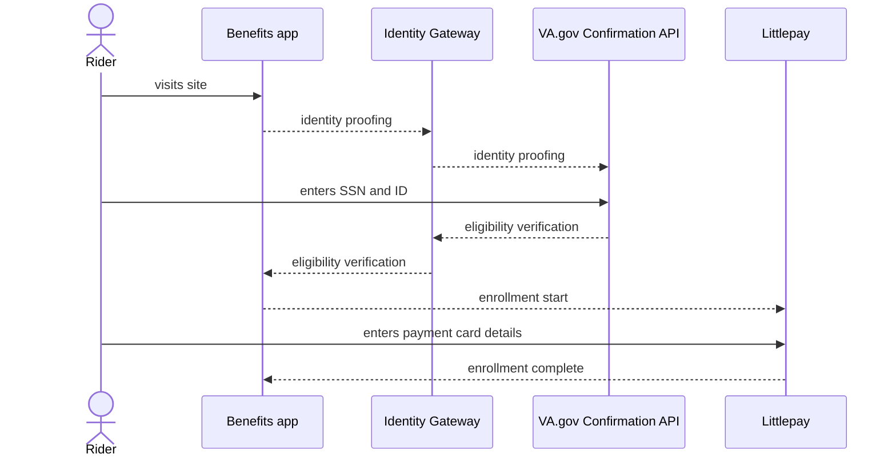

# Veterans

Another use case for the Benefits application is for U.S. veterans - people who have served in the active military, naval, or air service, and who were discharged or released therefrom under conditions other than dishonorable. The Benefits application verifies the person's veteran status to confirm eligibility and allows those eligible to enroll their contactless payment card for their transit benefit.

On the back-end, the app uses the Identity Gateway to connect to the [Veteran Confirmation API](https://developer.va.gov/explore/api/veteran-confirmation) to confirm veteran status. On the front-end, users must create or log into their Login.gov account to complete the eligibility verification process.

## Process

